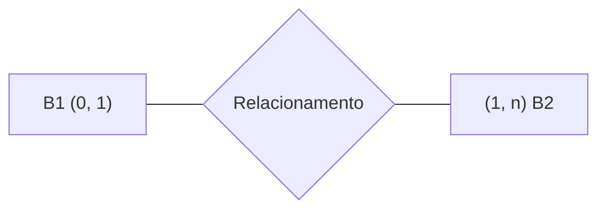

# SGBD
Um SGBD deve conter: 
- Compartilhamento de dados
- Restrições de acesso
- Fornecimento de Múltiplas Interfaces
- Representação de relacionamento complexo entre dados
- Restrições de integridade
- Backup e Restauração
- Controle de concorrência 
- Segurança, a Integridade (só inclui dados válidos relativamente à realidade)

![[bd-sgbd.png]]
### Metadados 
São informações sobre o próprio banco de dados e seus elementos como: esquema do banco, dicionário de dados (informações sobre os tipos de dados armazenados em cada tabela), estatísticas de desempenho, privilégios e permissões, logs e registros. 
### Dump 
O dump de banco de dados é o processo de criação de um arquivo que contém todas as informações presentes em um banco de dados em um determinado momento. Esse arquivo é uma espécie de “snapshot” do banco de dados, capturando todas as tabelas, registros, relacionamentos e configurações existentes naquele momento. Podendo ser importado de volta para o banco de dados posteriormente, se necessário.
### Backup
Processo essencial que envolve a cópia dos dados do banco de dados em um determinado momento para um local seguro, como um disco rígido externo, armazenamento em nuvem ou outro dispositivo de armazenamento. O objetivo principal do backup é proteger os dados contra perda, corrupção ou dano, permitindo a recuperação dos dados em caso de falha do sistema, erro humano, desastre natural ou ataque cibernético.
### Categorias de Restrições de Integridade
- **Integridade de domínio:** Refere-se a regras que definem o conjunto de valores válidos para uma coluna, por exemplo, um campo de idade que deve conter apenas valores numéricos positivos.
- **Integridade de entidade:** Garante que cada entidade tenha uma identificação única, geralmente por meio de uma chave primária.
- **Integridade referencial:** Assegura que os relacionamentos entre tabelas sejam consistentes, ou seja, que uma chave estrangeira corresponda sempre a um valor existente na tabela a que se refere.
- **Integridade de vazio:** Estabelece que certos campos não podem ser nulos, ou seja, devem conter dados obrigatoriamente.
### Tipos
#### Centralizado
Opera em um único sistema computacional e não distribuído por múltiplos locais. Ele é acessado por diferentes usuários e aplicações que podem estar em locais diferentes, mas o gerenciamento e o armazenamento dos dados são feitos em um único local. Esta característica centralizada permite um controle e gerenciamento eficientes dos dados e dos acessos simultâneos por vários usuários.
#### Distribuído 
O Sistema de Gerenciamento de Banco de Dados Distribuídos (SGBDD) controla o armazenamento e processamento de dados relacionados logicamente por meio de sistemas computacionais interconectados através de uma rede, em que tanto os dados como as funções de processamento são distribuídos entre os diversos locais.
##### Federado
Quando um SGBDD usa _middleware_ para que os SGBDs estejam fracamente acoplados, estamos falando de um SGBDD **Federado**. Isso significa que cada banco de dados pode operar de forma independente, mas também pode se comunicar com outros bancos por meio do middleware. Essa comunicação permite o acesso e a manipulação de dados entre diferentes bancos de dados, sem a necessidade de integrá-los completamente em uma única base.
#### Rede
Neste modelo, os dados são organizados em uma estrutura de rede ou gráfico, onde cada registro pode ter vários pais e vários filhos. Esta estrutura permite um relacionamento mais complexo entre os registros.
#### Hierárquico 
O modelo hierárquico consiste em uma coleção de registros que são conectados em uma estrutura de árvore portanto, similar ao **modelo de rede**, no sentido de que dados e relacionamentos entre dados são também representados por registros e ligações, respectivamente.
#### Orientado a Objetos
Se baseia nos conceitos da orientação a objetos, como a encapsulação de dados e métodos, a herança e o polimorfismo. Essa abordagem foi uma resposta à necessidade de lidar com tipos de dados mais complexos e com um comportamento associado a eles, ou seja, objetos que combinam estado (dados) e comportamento (funções ou métodos).
# DER (Diagrama Entidade Relacionamento) 


- B1 precisa ter 1 ou vários relacionamentos com B2
- B2 pode ter nenhum um somente um relacionamento com B1

 **Total**: significa que para cada ocorrência da entidade genérica, existe sempre um ocorrência em uma das entidades especializadas
 **Parcial**: uma entidade na superclasse não precisa necessariamente ser membro de pelo menos uma das subclasses na especialização
 **Exclusiva**: significa que uma ocorrência da entidade genérica A é especializada no máximo uma vez, ou seja, uma instancia de A aparece apenas uma vez nas entidades B ou C, nunca em ambas ao mesmo tempo.
# Normalização
- Cada forma normal depende das anteriores estarem sendo cumpridas.

 #### 1 FN
 Apenas valores atômicos, não há grupos repetidos, existe uma chave primaria, não possui atributos multivalorados, compostos ou relações aninhadas (uma tabela dentro da outra).
 #### 2 FN
 Conceito de dependência funcional, somente se cada atributo de R não-chave for total dependente da PK de R, válido somente se R tiver um chave primária composta.
 #### 3 FN
 Baseada no conceito da dependência transitiva, não deve haver dependência de uma coluna a chave primaria e a outro campo na coluna.
 #### 4 FN 
 Não pode conter dependências multivaloradas.
 #### 5 FN
 Dependência de junção. Quando uma tabela T pode ser decomposta em outras tabelas como T1, T2, T3
# Conceitos 
 #### CONCEITUAL
 Definição de user-views, saída, requerimentos, diagramas (relacionamento, entidades, atributos), independente de implementação em um SGBD.
 #### LÓGICO
 Definição das tabelas, colunas, relacionamentos, verificação de normalizações e integridade.
 #### FÍSICO
 Definição de tabelas, views, indexes que estão relacionados com a parte física do armazenamento.
 
 ## Independência 
 A arquitetura lógica em 3 níveis pode ser usada para esclarecer o conceito de independência de dados, que pode ser definida como a capacidade de alterar o esquema em um nível sem alterar o esquema do nível imediatamente superior.
- **Independência de dados LÓGICA** - é a capacidade de alterar o esquema **CONCEITUAL** sem alterar o esquema **EXTERNO** ou programas de aplicação.
- **Independência de dados FÍSICA** - é a capacidade de alterar o esquema **INTERNO** sem alterar o esquema **CONCEITUAL**. Alterações no esquema interno podem ser necessárias, pois alguns arquivos físicos são reorganizados – por exemplo, pela criação de estruturas de acesso adicionais – para melhorar a performance de consulta ou atualização.
#### ACID 
 ##### Atomicidade 
 Garante que todas as alterações realizadas por uma transação serão efetivadas no banco de dados, ou nenhuma delas, caso ocorra algum problema. Ou seja, não há atualização parcial da transação. 
 ##### Consistência
 A execução de uma transação deve levar o banco de dados de um estado consistente a um outro estado consistente;
 ##### Isolamento
 Propriedade que permite que os eventos em uma transação não interfiram nos eventos de outra transação concorrente. 
 ##### Durabilidade
 Garante que o resultado de toda transação executada com sucesso deverá ser mantido no banco de dados, mesmo na ocorrência de falhas.
# SQL
 #### DDL (DATA DEFINITION LANGUAGE) 
 Create, Drop, Truncate, Rename, Alter, Constraint
 #### DML (DATA MANIPULATION LANGUAGE)
 Select, Where, And, Or, Not, Order By, Insert, Update, Delete, Limit 
#### Join
Um **Join**, também conhecido como **Inner Join** combina resultados de diferentes tabelas baseado em colunas que estão relacionadas.

```sql
SELECT u.first_name, u.salary, r.name 
FROM users u 
JOIN users_roles ur ON u.id = ur.user_id 
JOIN roles r ON ur.role_id = r.id;
```
#### Left/Right (Outter) Join  
Usado para retornar todos os resultados que estão relacionados pela chave além de trazer todos os resultados do lado esquerdo/direito da junção que apresentam valores nulos. 

```sql
SELECT u.first_name, u.salary, p.bio
FROM users u 
LEFT ou RIGHT JOIN profiles p ON u.id = p.user_id;
```
#### Full (Outter) Join
Usado para retornar todos os resultados de ambas as tabelas com os valores que não combinam preenchidos com null. A diferença para um inner join é que quando T1 ou T2 possuírem algum valor que o outro não possui, essa tupla ainda será apresentada na tabela mas sem valores correspondentes ao lado oposto, somando assim a quantidade n\*2 de linhas null no total com o resultado da query.

```sql
SELECT u.first_name, u.salary, p.bio
FROM users u 
FULL JOIN profiles p ON u.id = p.user_id;
```
#### Group By 
Agrupa resultados com base em uma coluna. (Geralmente utilizado com funções de agregação)

```sql
SELECT r.name, COUNT(u.id) 
FROM users u
JOIN users_roles ur ON ur.user_id = u.id
JOIN roles r ON r.id = ur.role_id 
GROUP BY r.name;
```

Agrupar pro todos as combinações.

```sql
GROUP BY CUBE (coluna1, coluna2);
```
#### Having
Existe pois o **WHERE** não pode ser usado dentro de funções de agregação, como o Group By. 

```sql
SELECT r.name, COUNT(u.id) 
FROM users u
JOIN users_roles ur ON ur.user_id = u.id
JOIN roles r ON r.id = ur.role_id 
GROUP BY r.name
HAVING r.name NOT LIKE 'c%';
```
#### Alter Table
Alterar o estado das colunas.

```sql
-- Adicionar
ALTER TABLE Customers  
ADD Email varchar(255);

-- Remover
ALTER TABLE Customers  
DROP COLUMN Email;

-- Alterar
ALTER TABLE Customers
ALTER COLUMN Email TYPE VARCHAR(255);

-- Renomear
ALTER TABLE Customers  
RENAME COLUMN Email to EmailNovo;
```
#### Grant
Altera as permissões do usuário.

```sql
GRANT <permissions> ON <object> TO <user or role> [WITH GRANT OPTION];]
-- Dar tudo :)
GRANT ALL PRIVILEGES ON DATABASE database TO usuario;
```
#### Role
Criar um novo usuário.

```sql
CREATE ROLE username WITH LOGIN SUPERUSER CREATEDB CREATEROLE PASSWORD 'password';
```