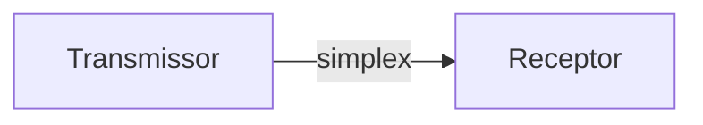
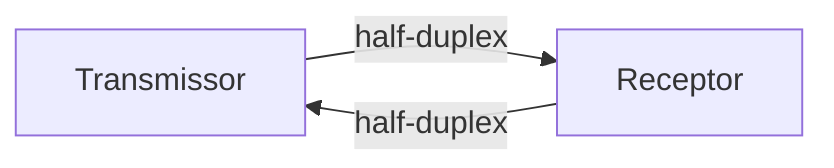
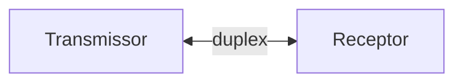

# Comunicação
 ##### LAN
 Comunicação entre dispositivos de uma distância relativamente curta (Ethernet. Wi-Fi).
 ##### MAN
 Comunicação de redes em uma área metropolitana ou similar. 
 ##### WAN
Comunicação entre dispositivos de forma internacional (VPS, Internet, 5g).
#### Simplex
Transmissão de dados unidirecional 

#### Half-Duplex
Transmissão bidirecional, no entanto por compartilhar o mesmo canal de comunicação os dispositivos não recebem os dados ao mesmo tempo.

#### Duplex
Comunicação totalmente bidirecional.

#### Topologias 
 ##### Barramento
 Todos os dispositivo estão conectados por um único cabo. (Limitado a apenas uma operação por dispositivo)
 ##### Estrela
 Utiliza um periférico concentrador, normalmente um hub, interligando todos os dispositivos da rede.
 ##### Anel
 Cada dispositivo é conectado no vizinho formando um anel.
# Meios de transmissão 
 ##### Cabo coaxial
 Fio de cobre revestido por um material isolante, geralmente uma malha sólida.
 ##### Par trançado
 Cabos mais utilizados atualmente, um com blindagem a interferências eletromagnéticas e outra sem.
-  Vai da categoria 1 até a 7.
 ##### Fibra ótica
  Transmite dados através de meios luminosos.
- Sucessores do par trançado.
- Super velocidade
- Transmitem para distâncias ilimitadas.
- multimodo degrau, multimodo gradual, monomodo.
# Arquitetura TCP/IP (IETF)
Modelo divido em 4 camadas.

 #####  Camada enlace
  A mais baixa do modelo, dando suporte a camada de rede, através do serviços físicos e lógico ao meio físico. 
- ARP (Address Resolution Protocol), 
- Ethernet 
 ##### Camada rede ou Inter-Redes
  Integra toda a arquitetura, mantendo-a unida, sua tarefa é permitir que o host injete pacotes em qualquer rede e garantir o seu tráfego 
- IP (Internet Protocol) 
- ICMP (Internet Control Message Protocol)
 ##### Camada transporte
  permite a conversação entre as entidades pares dos hosts de origem e destino.
- TCP (Transmission Control Protocol)
- UPD (User Datagram Protocol) 
 ##### Camada aplicação
 protocolos que dão suporte as aplicações do usuário.
- SMTP (Envio de e-mails), HTTP, IMAP (Envio e recebe e-mails, mais complexo), FTP, POP3 (Recebimento de e-mails, mais antigo)
- DHCP (Dynamic Host Configuration Protocol): Configuração dinâmica de servidores.
- LDAP (Lightweight Directory Access Protocol): Acesso e escrita em diretórios.
- SNMP (Simple Network Management Protocol):  usada para o gerenciamento de redes, como roteadores, switches e servidores.
#### Transmissões de redes

 ##### UNICAST
 Um para um
 ##### BROADCAST
 Um para todos
 ##### MULTICAST
 Um para todos, no entanto tem que estar no grupo
 ##### ANYCAST
 Envia para qualquer um em grupo mas prioriza o mais perto e eficiente 
#### VPN
Túnel criptografado entre dispositivos.

- Utilizado para acesso remoto.
- Protocolos de segurança: 
	- PPTP (não é tão seguro)
	- IPsec com ESP (Tunneling), 
	- SSTP (Secure Socket Tunneling Protocol)

 ##### Forwarding
 É a operação de encaminhamento de pacotes de dados de uma rede para outra, baseado em suas informações de endereço.
 ##### Tunneling
 É o processo de encapsular um pacote de dados dentro de outro, para que ele possa ser transmitido em uma rede que não suporta o tipo original de tráfego.
 ##### Traffic Shaping
  É a técnica de controlar e gerenciar o tráfego de rede, de modo a garantir a qualidade do serviço para aplicações sensíveis ao tempo.
 ##### Traffic Policing
  É a técnica de monitorar o tráfego de rede e limitar o volume de dados que é transmitido, a fim de garantir que não haja sobrecarga na rede.
 ##### Traffic Filtering
  É a técnica de restringir o tráfego de rede, permitindo somente o tráfego especificado pelas regras de filtragem.
# Protocolos
- Protocolos de roteamento: RIP, BGP, OSPF
#### ARP
Fornece resolução dinâmica de endereços IP, MAC (endereço físico da interface)

- Permite obter o MAC através do IP
- Baseado em mensagens, REQUEST e REPLY
	- REQUEST: Requisição da conversão do endereço IP em MAC.
	- REPLY: Reposta da requisição.
- Análise do cache do arp:  **arp -a** 
#### IP
É o protocolo oficial de transmissão de pacotes independentes, também chamados de datagramas, pela internet.

- Responsável por fragmentar em pacotes menores para a transmissão através do MTU.
- Também realiza a ação de desfragmentação.
- ipconfig: lida com as configurações de rede local, gateway, máscaras, DNS.
- TTL - Controla o número de saltos que um pacote entre redes pode realizar.
#### ICMP
Protocolo de controle de troca de mensagens da internet.

- Comunica mensagens de erro, diagnósticos, informações.
- Criado para o auxilio do **IP**.
- Transmitidas em datagramas IP (pacotes).
#### TCP
Protocolo de transmissão usada de ponta a ponta nesse processo

- Orientado a conexão, necessitando de um handshake antes de iniciar.
- Também chamado de circuito virtual.
- Ordena os pacotes na chegada.
- Projetado para comunicações UNICAST.
- Opera em nível Octeto
#### UDP
Protocolo sem conexões, não confiável, para aplicações que não necessitam do fluxo de controle do TCP

- Transmissão de dados rápida e eficiente, boa para streaming de vídeos e jogos on-line.
- Orientado a datagramas.
- Utilizado em DNS, DHCP, RIP.
#### DHCP
Permite executar configuração dinâmica nos hosts de uma rede.

- Concede IP, máscaras, gateway padrão, DNS.

1. Um cliente envia um pacote UDP requisitando uma configuração de serviço
2. Os servidores DHCP respondem com uma configuração adequada.
#### FTP
Protocolo para a transferência de arquivos baseado em conexões IP utilizando o TCP.

- Portas de comunicação: 21, Porta de transferência: 20
- Não é um protocolo seguro por padrão mas é possível utilizar protocolos de segurança como SSL/TSL na forma de FTPS ou SFTPS utilizando SSH.
- Opera em dois modos:
	1. Ativo: O cliente escuta conexões que chegam do servidor (não é muito utilizado).
	2. Passivo: Envia um comando e recebe um endereço de IP que é usado para iniciar um canal de dados.
- Transferidos em ASCII ou Binário (byte por byte).

# Elementos de interconexão
#### Gateway 
Atuam como dispositivo de intermediação de comunicação entre diferentes redes ou sistemas.

 - Conhecidos como conversores de protocolos.
 - Pode ser vista como uma porta de entrada e saída que atua como intermediário entre o computador e a internet.
#### Switches
São pontes que conectam várias portas, eles enviam quadros de dados somente para a porta de destino.

- Conectam dispositivos em uma rede local.
#### Roteadores
São pontes que atuam na camada de modelo OSI, responsável por decidir qual caminho percorrer para interligar diferentes caminhos.