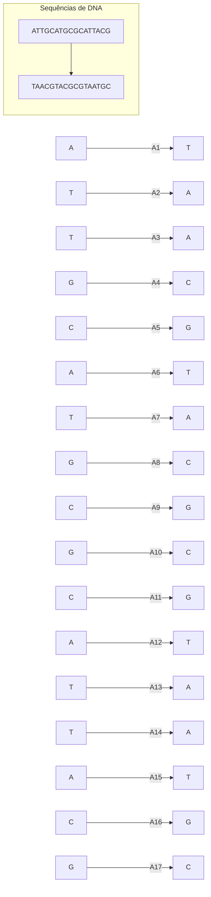

A aplicação dos princípios da **Química** no estudo das **substâncias orgânicas** tem sido benéfica para químicos e biólogos. Para os químicos, isso levou ao surgimento da **Química Orgânica**, que estuda **substâncias** contendo carbono (C) e hidrogênio (H). Hoje, é possível analisar e identificar qualquer **substância orgânica** em laboratório e até produzir artificialmente **proteínas**, **açúcares**, **hormônios** e **gorduras**, além de criar novas **substâncias**.

```ad-summary
#### Importância da teoria atômica
O desenvolvimento da **teoria atômica** foi um passo importante para entender a estrutura e o funcionamento dos seres vivos. Segundo essa teoria, a matéria é composta por pequenas partículas chamadas **átomos**. A variedade de **substâncias** na natureza, incluindo as que formam os seres vivos, resulta de diferentes combinações entre os **átomos** dos 89 **elementos químicos** naturais. Por exemplo, a combinação de dois **átomos** de hidrogênio (H) com um **átomo** de oxigênio (O) forma uma **molécula** de **água** (H2O). Já a combinação de dois **átomos** de **hidrogênio** com um **átomo** de enxofre (S) resulta em gás sulfídrico (H2S), que tem um odor desagradável.
```

Para os biólogos, a **Química** foi crucial para entender a estrutura e o funcionamento das **células**. Este campo é conhecido como **Bioquímica**, que revelou a existência de milhares de **substâncias** diferentes em uma única **célula** e as complexas redes de **reações químicas**. Essa complexidade demonstra que os seres vivos são extremamente organizados.

```ad-info
#### Principais elementos dos seres vivos
Na matéria que constitui os seres vivos, predominam certos **elementos químicos**: carbono (C), hidrogênio (H), oxigênio (O), nitrogênio (N), fósforo (P) e enxofre (S). Estes, constituem cerca de 98% da massa corporal de grande parte dos seres vivos.

O carbono é o constituinte essencial de todas as **moléculas orgânicas**. É a versatilidade dos **átomos** de carbono, que podem ligar-se entre si e com **átomos** de diversos **elementos químicos**, que torna possível a grande variedade de **moléculas orgânicas**.
```

```ad-info 
#### Substâncias químicas do seres vivos
A **água** é a **substância** mais abundante em um ser vivo, constituindo cerca de 70% a 85% de sua **massa corporal**. O restante distribui-se entre **proteínas** (10% a 15%), **lipídios** (2% a 3%), **glicídios** (1%) e **ácidos nucleicos** (1%), além de 1% de **sais minerais** e de outras **substâncias**.
```

Na natureza, são raros os **átomos** encontrados em estado isolado; na maioria dos casos, eles se ligam formando **substâncias químicas**. Dependendo do tipo de **ligação química** entre os átomos, as substâncias podem ser **moléculas** ou **compostos iônicos**.
### A água como solvente
Por suas propriedades, a **água** é indispensável à vida. Entre as propriedades da **água** importantes para os seres vivos, o papel fundamental da água é como **solvente**, participando de **reações químicas** e como moderador de temperatura, além da adesão e da coesão entre suas **moléculas**, decisivas para o funcionamento das plantas

Atividades essenciais à vida, como o **transporte de substâncias** e **reações enzimáticas**, requerem que as **moléculas** estejam dissolvidas em um meio líquido. A **água** é fundamental nesse processo por ser um excelente **solvente**, capaz de dissolver **substâncias** como **sais**, **gases**, **açúcares**, **aminoácidos**, **proteínas** e **ácidos nucleicos**, ganhando o título de 
"**solvente** universal".

Dissolver, em termos químicos, significa separar os agregados ou cristais de uma **substância** usando um **solvente**. Por exemplo, ao adicionar açúcar ou sal à água, as **moléculas** de **água** se interpõem entre as **partículas** dos cristais, dissolvendo-os e formando uma **mistura homogênea** chamada **solução**, composta pelo **solvente** (**água**) e pelos **solutos** (**substâncias** dissolvidas).

O **citosol**, o líquido nas células vivas, é uma **solução aquosa** com diversas **substâncias**. O sangue e outros líquidos corporais também são **soluções aquosas**, contendo **glicídios**, **sais**, **aminoácidos** e **proteínas**.

**Substâncias** que se dissolvem na **água** são chamadas **hidrofílicas**, como muitos **glicídios** e **proteínas**. A solubilidade delas se deve às regiões carregadas eletricamente que interagem com as **moléculas** de **água**. **Substâncias** que não se dissolvem em **água** são chamadas **hidrofóbicas**, como **óleos** e **gorduras**, cujas **moléculas** são **apolares** e não interagem com a **água**.

![[bio-agua-solvente.png]]
Quando o sal de cozinha (NaCl) é dissolvido em **água**, as **moléculas** de **água**, que têm regiões com cargas elétricas, interagem com os **íons** do sal:

1. As regiões negativas das **moléculas** de água são atraídas pelos **íons** positivos de sódio (Na⁺).
2. As regiões positivas das **moléculas** de água são atraídas pelos **íons** negativos de cloro (Cl⁻).

Essa interação entre as **moléculas** de água e os **íons** do sal separa os **íons** Na⁺ e Cl⁻, rompendo a estrutura cristalina do sal e dissolvendo-o na **água**.
## Metabolismo celular
Os **sistemas biológicos**, assim como tudo no universo, seguem duas leis básicas da **termodinâmica**. A primeira delas diz que, nos **processos físicos** e **processos químicos**, a **energia** pode ser ganha ou perdida, transferindo-se de um sistema para outro, mas não pode ser criada nem destruída. A segunda **lei da termodinâmica** diz que a energia inevitavelmente se dissipa, isto é, passa de uma forma utilizável, como a dos **fótons da luz** e a dos **elétrons** das **ligações químicas**, para uma forma menos utilizável, o calor. Assim, para sobreviver, todo ser vivo necessita continuamente de **energia**, que é obtida a partir de **substâncias orgânicas** constituintes dos alimentos.
### Energia dos alimentos 
Se você analisar as tabelas de composição nutricional impressas nas embalagens de alimentos, verificará que elas geralmente trazem as quantidades relativas dos principais componentes do produto e a quantidade de **energia** que ele contém.

O **valor energético** dos alimentos, expresso em **quilocalorias**, refere-se à parcela de **energia** disponível presente nas **ligações químicas** de suas **moléculas**. Por exemplo, 40 g de aveia em flocos (cerca de 2,5 colheres de sopa) podem fornecer ao organismo por volta de 140 kcal.

```ad-info
uma **quilocaloria** equivale a 1.000 cal.
```

Mesmo sem realizar nenhum exercício físico, nosso corpo está sempre gastando **energia**. Veja, na tabela uma estimativa da quantidade de **calorias** despendidas por uma pessoa de 64 kg em algumas de suas atividades diárias.

| Atividade      | Nº de horas | Massa corporal (kg) | kcal/kg | kcal (total) |
| -------------- | ----------- | ------------------- | ------- | ------------ |
| Dormindo       | 8           | 64                  | 1.0     | 512.0        |
| Sentada        | 3           | 64                  | 1.4     | 268.8        |
| Escrevendo     | 5           | 64                  | 1.6     | 512.0        |
| Em pé          | 2           | 64                  | 1.8     | 230.4        |
| Andando        | 3           | 64                  | 3.0     | 576.0        |
| Exercitando-se | 3           | 64                  | 5.0     | 960.0        |
| **Total**      |             |                     |         | **3.059,2**  |
### Anabolismo e catabolismo
A **energia** que um ser vivo necessita continuamente é utilizada para manter suas diversas **atividades celulares**, nas quais **moléculas** são modificadas, quebradas ou unidas entre si, transformando-se em outras. Essa intensa e incessante atividade de transformação química constitui o **metabolismo**.

As **reações metabólicas** costumam ser classificadas em dois tipos: **reações de síntese** e **reações de degradação**. As **reações de síntese** são aquelas em que **moléculas** mais simples são unidas para formar **moléculas** de maior complexidade. Nas **reações de degradação**, **moléculas** complexas são quebradas, transformando-se em outras mais simples. 

```ad-tip
Por exemplo, a união de **aminoácidos** para formar **proteínas** é uma **reação de síntese**, enquanto a quebra do **glicogênio** em **moléculas** de **glicose** é uma **reação de degradação**.
```

O conjunto de **reações de síntese**, por meio das quais um ser vivo constrói as complexas **moléculas orgânicas** que formam seu corpo, constitui o **anabolismo**. As **reações de degradação** de **moléculas** constituem o **catabolismo**.

```ad-info
É por meio das **reações catabólicas** que os seres vivos obtêm a matéria-prima e a **energia** necessárias à vida.
```
### Energia de ativação nas enzimas
A estratégia desenvolvida pelos seres vivos para superar a **barreira inicial** das **reações químicas** foi a utilização de **enzimas**, **proteínas catalisadoras** que diminuem a quantidade de **energia** necessária para ativar os **reagentes**. A **enzima** conduz os **reagentes** por um "atalho energético", em que a **reação** pode ser iniciada com um nível bem mais baixo de **energia de ativação**.

![[bio-energia-enzimas.png]]
### ATP 
A **energia** liberada na degradação de **moléculas orgânicas** pelas **células** não é usada diretamente para a realização de **trabalho celular**. Antes de ser empregada nos **processos celulares**, a **energia** é transferida para **moléculas** de uma substância chamada **trifosfato de adenosina**, nas quais fica armazenada. Essa **substância**, mais conhecida pela sigla **ATP**, desempenha um papel fundamental em todos os tipos de **célula**, _captando_ e _armazenando_ a **energia** liberada nas **reações celulares exotérmicos** e transferindo-a, posteriormente, para os **processos celulares endotérmicos**.

```ad-info
O estoque de **ATP** em uma única **célula** é da ordem de um bilhão de **moléculas**, que são usadas e repostas a cada dois ou três minutos, ininterruptamente. Por essa razão, alguns pesquisadores comparam o **ATP** a uma _moeda energética_ que circula dentro da **célula** e _custeia_ os **gastos metabólicos**.
```

```ad-note
O **trifosfato de adenosina**, ou **ATP**, é um **nucleotídeo** constituído pela **base nitrogenada** **adenina** unida ao **glicídio** **ribose**, que, por sua vez, se une a uma cadeia de três **grupos fosfatos**. As **ligações químicas** entre os **fosfatos** do **ATP** são ligações de alta **energia** e costumam ser representadas graficamente pelo símbolo _~_.
```

Durante a **oxidação** de **moléculas orgânicas** do alimento, parte da **energia** liberada pelos **elétrons** é utilizada para a **síntese de moléculas de ATP**, ficando armazenada nas **ligações químicas** entre seus **grupos fosfatos**. 

```ad-info
A **energia** que não é transferida para o **ATP** dissipa-se como calor, ao passo que a **energia** armazenada no **ATP** pode ser transferida para os mais diversos tipos de **processos metabólicos** que acontecem em uma **célula**.
```

O **ATP** é normalmente sintetizado a partir de uma **molécula** precursora semelhante a ele, mas que possui apenas dois **fosfatos**: o **ADP** ou **difosfato de adenosina**. A **síntese de ATP** ocorre pela adição de um **grupo fosfato inorgânico**, simbolizado por **_Pᵢ_**, ao **ADP**. Essa reação demanda quantidade considerável de **energia**. A quebra do **ATP** em **ADP** e **_Pᵢ_** fornece quantidade equivalente de energia para as **atividades celulares**.

```ad-tip
O **ATP** pode perder um **grupo fosfórico** e transformar-se em **ADP**, liberando **energia**. O **ATP** tem duas ligações de alta energia e o **ADP** tem somente uma dessas ligações. Pode-se considerar o **ATP** como uma bateria celular "_carregada_" de **energia**, enquanto o **ADP** representa a forma “_descarregada_”.
```

![[bio-celula-atp.png]]

O mecanismo mais comum de fornecimento de **energia** para os **processos celulares** é a transferência de um **grupo fosfato** do **ATP** para outras **moléculas**, o que provoca nelas as alterações necessárias à realização do **trabalho celular**.

```ad-tip
Por exemplo, na síntese de diversas **substâncias**, o **fosfato** é transferido a um dos **reagentes**, que adquire, assim, a **energia** necessária para se unir a outras **moléculas** e gerar os **produtos**. 
```

No **transporte ativo** de **íons** realizado pelas **bombas de sódio-potássio** da **membrana plasmática**, o **grupo fosfato** liberado na quebra do **ATP** combina-se com as **proteínas transportadoras** da membrana, provocando mudanças em suas estruturas espaciais. Isso permite que essas **proteínas** movimentem-se através da **membrana plasmática** e carreguem **íons** de sódio (Na⁺) para o **meio extracelular**. Ali, elas capturam **íons** de potássio (K⁺), liberam o excesso de **energia** recebida com o **fosfato** e voltam à sua configuração original, carregando os novos **íons** para dentro da **célula**. O **fosfato** (**_Pᵢ_**) solta-se então das **proteínas transportadoras** e pode ser utilizado na síntese de novas **moléculas** de **ATP**.

```ad-note
Nos **movimentos celulares**, a **energia** obtida do **ATP** faz com que **moléculas** de **miosina** adquiram uma configuração instável, com alta **energia** potencial. Nessa condição, elas puxam as **fibras de actina** com as quais estão em contato, realizando **trabalho**. O deslizamento das **fibras de actina** sobre as **moléculas** de **miosina** é responsável por muitos **movimentos celulares**. No caso específico dos **músculos**, esse deslizamento faz com que as **células** encurtem, promovendo a **contração muscular**.
```

![[bio-celula-atp-moeda-energitica.png]]

```ad-note
A imagem acima representa o papel do **ATP** como _moeda energética_ do **metabolismo celular**. **Reações** em que **moléculas orgânicas** do alimento são degradadas, como as da **respiração celular**, transferem **energia** para a **síntese de moléculas de ATP**. Estas, ao serem degradadas, fornecem **energia** para **trabalhos celulares**, como a **contração muscular**. 
```

![[bio-atp-caminhos.png]]

```ad-note
A imagem acima representa os caminhos da **energia** nos seres vivos, mediada pelo **ATP**.
```

```ad-summary
##### A teoria quimiosmótica que explica a produção de ATP

A **energia** liberada pelos **elétrons** em sua passagem pela **cadeia respiratória**, é usada para concentrar **íons** _H⁺_ no espaço entre as **membranas mitocondriais**. Em alta concentração nesse estreito compartimento, a tendência desses **íons** é voltar à **matriz mitocondrial**, gerando, assim, uma pressão potencial de **difusão**, chamada **força protomotiva**. Mas os **íons** _H⁺_ só podem retornar ao interior da **mitocôndria** passando através de um complexo de **proteínas**, denominado **sintetase do ATP**, presente na **membrana mitocondrial interna**. Esse **complexo proteico** é comparável à turbina de uma usina hidrelétrica: ele possui um rotor interno que gira, movido pela passagem dos **íons** _H⁺_. Nesse processo, a **energia potencial** de **difusão** dos **íons** _H⁺_ é convertida em **energia mecânica** (rotação da **sintetase**) e, em seguida, em **energia química**, na ligação entre os **fosfatos do ATP**.

De volta ao interior da **mitocôndria**, os **íons** _H⁺_ combinam-se aos **elétrons** transportados pela **cadeia respiratória** e aos **átomos** provenientes do **gás oxigênio** para formar **moléculas de água**.

Esse mecanismo de produção de **ATP** nas **mitocôndrias** e também nos **cloroplastos** foi comprovado em diversos experimentos e tornou-se conhecido como **teoria quimiosmótica**.

![[bio-atp-quimiosmotica.png]]
```
### Respiração celular
A maioria dos seres vivos produz **ATP** para suas necessidades energéticas por meio da **respiração celular**, um processo de **oxidação** em que o **gás oxigênio** atua como **agente oxidante** de **moléculas orgânicas**. Nesse processo, **moléculas** de **ácidos graxos** ou de **glicídios**, principalmente **glicose**, são degradadas, formando **moléculas** de gás carbônico (CO₂) e de **água** (H₂O) e liberando **energia**, utilizada na produção de **moléculas** de **ATP** a partir de **ADP** e **_Pᵢ_**.

```ad-tip
A quantidade exata de **ATP** produzida durante a **respiração celular** pode variar, mas em condições ideais, a partir de uma **molécula de glicose**, podem ser produzidas  aproximadamente 36 a 38.
```

A **respiração celular** da **glicose** é equivalente à sua **combustão**, em termos de **reagentes** e **produtos**. Nos dois casos, uma **molécula** de **glicose** reage com seis **moléculas** de gás oxigênio, produzindo seis **moléculas** de **gás carbônico** e seis **moléculas** de **água**:
$$
C_6H_{12}O_6+6O_2→6CO_2+6H_2O
$$
```ad-info
Se toda essa quantidade de **energia** fosse liberada de uma vez na **respiração celular,** como acontece na **combustão**, a **célula** seria danificada. No entanto, na **respiração celular,** a energia das **moléculas orgânicas** é liberada pouco a pouco, em uma sequência ordenada de **reações químicas** bem controladas, e parte dessa **energia** é armazenada na forma de **ATP**.
```
#### Etapas da respiração celular
A **degradação da glicose** na **respiração celular** ocorre em três **etapas metabólicas**: **glicólise**, **ciclo de Krebs** e **fosforilação oxidativa**. Nas **células eucarióticas**, a **glicólise** ocorre no **citosol**, enquanto o **ciclo de Krebs** e a **fosforilação oxidativa** ocorrem no interior das **mitocôndrias**.
##### Glicólise
A **glicólise** é uma sequência de 10 **reações químicas** **catalisadas** por **enzimas** livres no **citosol**. Nela, uma **molécula** de **glicose** é quebrada em duas **moléculas** de **ácido pirúvico**, com saldo líquido de duas **moléculas** de **ATP**. O processo tem início com a ativação da **molécula de glicose**, que ocorre pela adição de dois **fosfatos energéticos** provenientes de duas **moléculas** de **ATP**. Com isso, a **molécula** de **glicose** torna-se _instável_ e quebra-se em duas **moléculas** menores de **ácido pirúvico**. 

```ad-info
A **glicólise** é uma etapa **anaeróbia** do processo de **degradação da glicose**, pois não necessita de **gás oxigênio** para ocorrer. As etapas seguintes, porém, são **aeróbias** e só ocorrem se houver **gás oxigênio** suficiente. Na falta desse gás, as **moléculas** de **ácido pirúvico** são transformadas, ainda no **citosol**, em **ácido láctico** ou em **etanol**, dependendo do tipo de **organismo**. Esse processo é denominado **fermentação**.
```

![[bio-atp-glicose.png]]

```ad-note
O consumo inicial de dois **ATP** é um investimento energético que será recuperado durante a própria **glicólise**, pois a quebra da **glicose** em dois **ácidos pirúvicos** é suficiente para produzir 4 **moléculas de ATP**, ficando com o saldo positivo de 2 **moléculas de ATP**. 
```

A **glicólise** também libera quatro **elétrons** com nível alto de **energia** e quatro **íons** _H⁺_. Dois desses **íons** _H⁺_ permanecem livres no **citosol**, enquanto os outros dois e os quatro **elétrons** energizados são prontamente capturados por duas **moléculas** da **substância dinucleotídeo** de **nicotinamida-adenina**, ou **NAD**. **Moléculas** dessa **substância** na **forma oxidada** **(_NAD⁺_**) passam para o estado reduzido (**_NADH_**) ao capturarem **elétrons** e **íons** _H⁺_, como mostrado na **equação** a seguir: 
$$
2H^++4e^−+2\text{NAD}^+→2\text{NADH}
$$
A **equação química** que resume a **glicólise** é:
$$
C_6​H_{12}​O_6​+2\text{ADP}+2P_i​+2\text{NAD}+→2C_3​H_4​O_3​+2\text{ATP}+2\text{NADH}+2H^+
$$
```ad-tip
É importante notar que nessas **equações** não há produção de **água** e nem de **gás carbônico**.
```

```ad-summary
##### NAD (Nicotinamida adenina dinucleótido)
O **_NAD⁺_** desempenha papel central no **metabolismo energético** das **células**; ele captura **elétrons** de alta **energia** provenientes da degradação de **moléculas orgânicas** e fornece-os aos sistemas de **síntese de ATP**. Por essa capacidade de _aceitar_ **elétrons** energizados e **íons** _H⁺_, o **_NAD⁺_** é denominado _aceptor de elétrons_, ou _aceptor de hidrogênio_. Além disso, o **_NAD_** é uma **coenzima** derivada da **Vitamina B3**, ou seja, essa **vitamina** é fundamental para o processo de **glicolise**.
```
##### Ciclo de Krebs
O **ácido pirúvico** produzido na **glicólise** é transportado através das **membranas da mitocôndria** e, na **matriz mitocondrial**, reage imediatamente com uma **substância** denominada **_coenzima A_** (**_CoA_**). Nessa reação, são produzidas uma **molécula** de **_acetilcoenzima A_** (**_acetil-CoA_**) e uma **molécula de gás carbônico** (CO₂). 

Dela também participa uma **molécula** de **_NAD⁺**_, que se transforma em **NADH** ao capturar 2 **elétrons** de alta **energia** e 1 dos 2 **íons** _H⁺_ liberados na **reação**:
$$
\text{Ácido pirúvico}+\text{CoA}+\text{NAD}+→\text{Acetil}-\text{CoA}+\text{NADH}+CO_2​+H^+
$$
Na **matriz mitocondrial**, as **moléculas** de **_acetilcoenzima_** são **oxidadas** e originam, no final do processo, duas **moléculas** de **gás carbônico** e a **_coenzima A_** intacta. A **oxidação** completa da **_acetilcoenzima_** consiste de um conjunto de nove **reações químicas** sequenciais que formam um ciclo, pois uma **molécula** de **_ácido oxalacético_** une-se à **_acetilcoenzima_** no início do processo e é recuperada intacta no final. Esse conjunto de reações é conhecido como **ciclo de Krebs**.

![[bio-transformações-acido-piruvico.png]]
```ad-note
_A._ Esquema das transformações do **ácido pirúvico**. No interior da **mitocôndria**, o **ácido pirúvico** origina _**acetil-CoA**_, que participa da sequência de **reações químicas** do **ciclo de Krebs**. _B._ Representação esquemática de uma **mitocôndria** com parte removida para mostrar seus componentes internos. O **ciclo de Krebs** ocorre na **matriz mitocondrial**.
```

O **ciclo de Krebs** tem início com uma reação entre a **_acetil-CoA_** e o **ácido oxalacético**, em que é liberada a **molécula** de _**coenzima A**_ e formada uma **molécula** de **_ácido cítrico_**. Ao longo das oito **reações** subsequentes, são liberadas 2 **moléculas** de **gás carbônico**, **elétrons** de alta **energia** e **íons** _H⁺_. 

```ad-info
O _ácido oxalacético_ é recuperado intacto ao final do processo, pronto para se combinar com outra **molécula** de _acetil-CoA_ e reiniciar outro ciclo.
```

Os **elétrons** de alta **energia** e os **íons** _H⁺_ são prontamente capturados por **moléculas** de **_NAD⁺_**, que se transformam em **_NADH_**, e também por um outro aceptor de **elétrons**, o **dinucleotídeo** de **flavina-adenina** ou **_FAD_**, que se transforma em **_FADH₂_**. 

```ad-info
Ao longo de cada **ciclo de Krebs**, são formados 3 **_NADH_** e 1 **_FADH₂_**.
```

Em uma das etapas do ciclo, a **energia** liberada permite a formação direta de uma **molécula** de **trifosfato de guanosina** ou **GTP**, a partir de **GDP** (**difosfato de guanosina**) e _Pᵢ_.

```ad-tip
 O **GTP** é muito semelhante ao **ATP**; difere dele apenas por apresentar a **base nitrogenada** **guanina** em vez de **adenina**. É o **GTP** que fornece **energia** para alguns **processos celulares**, como a **síntese de proteínas**. O **GTP** também pode ser formado pela transferência do **fosfato energético** do **ATP** para um **GDP**; de forma similar, **ATP** pode ser gerado pela transferência do **fosfato** do **GTP** para um **ADP**.
```
##### Fosforilação Oxidativa
A síntese da maior parte do **ATP** gerado na **respiração celular** está acoplada à **reoxidação** das **moléculas** de **_NADH_** e **_FADH₂_**, que se transformam em **_NAD⁺_** e **_FAD_**, respectivamente. Nessa **reoxidação**, são liberados **elétrons** com alto nível de **energia** que, após perderem seu excesso de **energia**, reduzem o **gás oxigênio** a **moléculas** de **água**, de acordo com as seguintes **equações** gerais:
$$
2 \text{NADH} + 2 H^+ + O_2 \rightarrow 2 \text{NAD}^+ + 2 H_2O
$$
$$
 2 \text{FADH}_2 + O_2 \rightarrow 2 \text{FAD} + 2H
$$
```ad-info
A **energia** liberada gradativamente pelos **elétrons** durante sua transferência até o **gás oxigênio** é usada na produção de **ATP**. 
```

O termo **fosforilação oxidativa** refere-se justamente à produção de **ATP**, pois a adição de **fosfato** ao **ADP** para formar **ATP** é uma reação de **fosforilação**. Ela é chamada **oxidativa** porque ocorre em diversas **oxidações** sequenciais, nas quais o último **agente oxidante** é o **gás oxigênio** (O₂).
###### Cadeia transportadora de elétrons (cadeia respiratória)
Na **membrana interna da mitocôndria** há conjuntos de **proteína** dispostos em sequência que participam na condução dos **elétrons** do _**NADH**_ e do **_FADH₂_** até o **gás oxigênio**. 

```ad-info
Cada conjunto sequencial de **proteínas** recebe o nome de **cadeia transportadora de elétrons** ou **cadeia respiratória**.
```

Os **transferidores de elétrons** nas **cadeias respiratórias** são proteínas **denominadas** **citocromos**, que possuem ferro em sua composição. Cada tipo de **citocromo** é capaz de capturar **elétrons** com certo **nível de energia** e transferi-los, com um **nível de energia** menor, para o **citocromo** imediatamente seguinte.

A passagem dos **elétrons** ao longo da **cadeia respiratória** tem início quando o **_NADH_** doa seu par de **elétrons** ao primeiro aceptor da **cadeia respiratória**, que os transfere ao seguinte e assim por diante. Essa transferência dos **elétrons** de um componente da cadeia a outro faz com que eles percam **energia** gradativamente e possam, ao final da cadeia, combinar-se com o **gás oxigênio** (O₂), produzindo **água** na **reação**. O **gás oxigênio** só participa efetivamente da **respiração celular** nessa última etapa; no entanto, em sua ausência, o ciclo é rapidamente interrompido. 

![[bio-atp-cadeia-transporte.png]]

A **energia** liberada pelos **elétrons** durante sua passagem pela **cadeia respiratória** é usada para forçar a transferência de **íons** _H⁺_ para o espaço existente entre as duas **membranas mitocondriais**. 

![[bio-respiração-reações-itocondria.png]]

```ad-note
Representação esquemática das **reações** que ocorrem no interior da **mitocôndria**. Note que o **ácido pirúvico** e os **ácidos graxos** que penetram na **mitocôndria** (à esquerda) transformam-se em _acetilcoenzima A_, o ponto de partida das **reações intramitocondriais**, dando início ao **ciclo de Krebs**. Na **membrana mitocondrial interna**, ocorrem as reações da **cadeia respiratória** e da produção de **ATP**.
```

A maior parte do _**NADH**_ é produzida no interior da **mitocôndria**, durante a transformação do **ácido pirúvico** em _**acetil-CoA**_ e o **ciclo de Krebs**. Na **glicólise**, também são produzidas duas **moléculas** de **_NADH_**, mas estas não conseguem entrar na **mitocôndria** para doar seus **elétrons** à **cadeia respiratória**, pois a **membrana mitocondrial interna** é impermeável ao **_NADH_**.

```ad-note
 Um curioso mecanismo, porém, permite à **mitocôndria** aproveitar a **energia** do **_NADH_** produzido no **citosol**; a **membrana interna da mitocôndria** contém **proteínas** especiais, capazes de atuar como **pontes eletrônicas**, transportando **elétrons** de alta **energia** do **_NADH_** do **citosol** (que se **oxida** a **_NAD⁺_**) para um **_NAD⁺_** presente na **matriz mitocondrial**, o qual se reduz a **_NADH_**. Para todos os efeitos, é como se o **_NADH_** tivesse entrado na **mitocôndria**:
```

![[bio-etapas-metabolismo-aerobico.png]]

```ad-note
Na imagem acima, está representada as etapas do **metabolismo aeróbio** da **glicose** com produção de **ATP**. A **glicólise** ocorre no **citosol**, enquanto o **ciclo de Krebs** e a **cadeia respiratória** ocorrem no **interior da mitocôndria**. Cada **molécula de glicose metabolizada** pode produzir até 30 **ATP**.
```

```ad-summary
###### Rendimento Energético na Respiração Celular
A **energia** liberada pelos **elétrons** com alta **energia**, obtidos de uma **molécula** de **glicose** em sua passagem pela **cadeia respiratória**, pode formar até um máximo de 26 **moléculas** de **ATP**. Somando-se essas 26 **moléculas** aos dois **ATP** formados na **glicólise** e aos dois formados no **ciclo de Krebs** (um **GTP** para cada _**acetil-CoA**_), obtém-se o rendimento máximo da **respiração celular**, que é de 30 **moléculas** de ATP **por** **molécula** de **glicose**.
```
#### Fontes de energia para a respiração celular
Todas as nossas **células** **oxidam** **glicídios** para obtenção de **energia**; algumas, como as **células nervosas** do **encéfalo**, obtêm praticamente toda a **energia** de que necessitam pela **oxidação aeróbica** da **glicose**. É por isso que nosso **organismo** precisa manter estável a taxa desse **glicídio** no **sangue**: sua diminuição pode causar desmaios e até mesmo coma, por afetar diretamente o **sistema nervoso**. 

```ad-note
A **glicose** fica armazenada no **fígado** na forma de **glicogênio** e é liberada no **sangue** quando há diminuição da **glicemia** (taxa de **glicose** no **sangue**), como ocorre nos intervalos entre as refeições.
```

Apesar da importância da **oxidação aeróbica** dos **glicídios** em nossas **células**, a maior parte da **energia** utilizada por nosso **organismo** é proveniente de **lipídios**. A degradação de 1 g de **triglicerídeos** com formação de **gás carbônico** (CO₂) gera 6 vezes mais **ATP** do que a **oxidação** de uma quantidade equivalente de **glicogênio**.

Os **triglicerídeos** são armazenados no **citoplasma** das **células adiposas**, na forma de gotículas de **gordura**. Quando necessário, suas **moléculas** são quebradas em seus constituintes básicos, **glicerol** e **ácidos graxos**, e estes últimos são lançados na **corrente sanguínea**. 

```ad-info
As **células** do corpo humano, com exceção das do **sistema nervoso** e das **hemácias**, captam os **ácidos graxos** do **sangue**, utilizando-os na produção de **ATP**.
```

No interior das **células**, os **ácidos graxos** são transportados para as **mitocôndrias**, onde produzem **moléculas** de **_acetil-CoA_**. Da mesma forma que as moléculas de **_acetil-CoA_** produzidas a partir do **ácido pirúvico** na **oxidação** de **glicídios**, **moléculas** de **_acetil-CoA_** produzidas pela **oxidação** de **ácidos graxos** entram no **ciclo de Krebs** e são totalmente degradadas a **gás carbônico** (CO₂) e **água** (H₂O).

![[bio-utilização-nutrientes.png]]
### Fermentação
O principal processo **anaeróbico** de produção de **ATP** a partir de **substâncias orgânicas** é a **fermentação**, utilizada por muitos **fungos** e **bactérias** que vivem em ambientes pobres em **gás oxigênio**. 

```ad-info
Nossas próprias **células** pode fazer **fermentação** se faltar **gás oxigênio** para a **respiração celular**.
```

A **fermentação** realizada pela maioria dos **organismos**, como **leveduras**, certas **bactérias** e também por nossas **células musculares**, consiste em uma **glicólise** semelhante à que compõe a **respiração celular**. A diferença é que, na **fermentação**, o **ácido pirúvico** recebe **elétrons** e _H⁺_ do **_NADH_**, transformando-se em **ácido láctico**, ou em **álcool** **etílico** (**etanol**) e **gás carbônico**, dependendo do tipo de **organismo** que realiza o processo. 

```ad-tip
Se o **produto** da **fermentação** é **ácido láctico**, fala-se em **fermentação láctica**; se o **produto** é **álcool etílico**, fala-se em **fermentação alcoólica**.
```

A **fermentação** pode ser definida como um processo de degradação incompleta de **moléculas orgânicas** com liberação de **energia** para formação de **ATP**, em que o aceptor final de **elétrons** e de _H⁺_ é uma **molécula orgânica**. A parte final da **fermentação**, em que o **ácido pirúvico** é transformado em **ácido láctico**, ou em **etanol** e **gás carbônico**, é uma reação de **oxirredução**: o **ácido pirúvico** atua como aceptor final de elétrons e dos _H⁺_ liberados na **glicólise** e captados pelo **_NAD⁺_**
#### Fermentação Láctica
Na **fermentação láctica**, o **ácido pirúvico** originado da **glicólise** é transformado em **ácido láctico**. Esse processo é realizado por certas **bactérias** denominadas **lactobacilos**, que **fermentam** o **leite**. O sabor ligeiramente **ácido** de coalhadas e iogurtes deve-se justamente ao acúmulo de **ácido láctico**, que faz baixar o **pH** do leite e provoca a coagulação de suas **proteínas**, formando um coalho solidificado, usado também na fabricação de queijos.

Em nossas **células musculares**, durante um exercício físico muito intenso, o **gás oxigênio** que chega aos **músculos** pode não ser suficiente para suprir as necessidades respiratórias das **células musculares**. Nessas condições, elas passam a produzir **ATP** por meio da **fermentação láctica**.
$$
C_6​H_{12}​O_6​→2CH_3​CH(OH)COOH
$$
$$
(\text{Glicose}) → (\text{Ácido lático})
$$
```ad-info
 Embora gere menos **energia** que a **respiração aeróbica**, a **fermentação láctica** garante a produção de **ATP** nas situações de emergência. Entretanto, o acúmulo de **ácido láctico** causa dor muscular e intoxicação das **fibras musculares**.
```

Aos poucos, as **células musculares** eliminam o **ácido láctico** no **sangue**, de onde ele é removido pelas **células do fígado** e **reoxidado** a **ácido pirúvico**. Este pode ser degradado a CO₂ nas **mitocôndrias hepáticas** ou reconvertido em **glicose**, por meio de um processo denominado **gliconeogênese**.
#### Fermentação Alcoólica
Na **fermentação alcoólica**, o **ácido pirúvico** originado na **glicólise** transforma-se em **álcool etílico** e **gás carbônico**. Esse tipo de **fermentação** é realizado pelo **fungo** _Saccharomyces cerevisiae_, a **levedura** conhecida popularmente como fermento de padaria. 
$$
C_6​H_{12}​O_6​→2C_2​H_5​OH+2CO_2
$$
$$
(\text{Glicose}) → (\text{Etanol}) + (\text{Dióxido de carbono})
$$
```ad-note
Há milênios a humanidade utiliza essa espécie de **levedura** na fabricação de bebidas alcoólicas (vinhos, cervejas, aguardentes etc.) e de pão, no qual o **gás carbônico** é responsável pelas bolhas que inflam a massa e a tornam macia.
```
#### Fermentação Acética
Um outro processo biológico, conhecido como **fermentação acética**, é empregado na produção de vinagre. Ele é realizado por **bactérias** dos gêneros _Acetobacter_ e _Acetomonas_, que crescem espontaneamente em bebidas alcoólicas, como vinho, expostas ao ar, **oxidando** o **álcool**, que se transforma em **ácido acético**.
$$
C_2​H_5​OH+O_2​→CH_3​COOH+H_2​O
$$
$$
(\text{Etanol}) + (\text{Oxigênio}) → (\text{Ácido acético}) + (\text{Água})
$$
### Fotossíntese
Processo celular pelo qual a maioria dos **seres autotróficos** produz **substâncias orgânicas**, geralmente **glicídios** (**açúcares**). Na **fotossíntese**, a **energia luminosa** transforma-se em **energia potencial química**, armazenada nas **moléculas de glicídios** produzidas no processo. No tipo mais comum de **fotossíntese**, os **reagentes** são **gás carbônico** (CO₂) e **água** (H₂O), e os **produtos** formados são **glicídios** e **gás oxigênio** (O₂). 

```ad-tip
Esse tipo de processo ocorre em **plantas**, **algas** e certas **bactérias** (**cianobactérias** e **proclorófitas**).
```

Enquanto os **seres heterotróficos** dependem de outros seres vivos para se alimentar, os **seres autotróficos** são autossuficientes quanto à nutrição, pois eles mesmos produzem seus nutrientes orgânicos a partir da **fotossíntese**. Os **glicídios** produzidos na **fotossíntese** são utilizados como fonte de **energia** e de matéria-prima para a síntese de todos os componentes orgânicos dos **seres autotróficos**, tais como **proteínas**, **lipídios**, **ácidos nucleicos**, etc.

```ad-note
Devido principalmente à **etapa química** a **fotossíntese** é altamente influenciada pela temperatura, atingindo um rendimento ótimo entre 30 °C e 40 °C. Acima desses valores, há um decréscimo acentuado da **atividade fotossintética** que decorre da **desnaturação das enzimas** que **catalisam** as **reações** do processo.
```

![[bio-fotossintese.png]]


```ad-info
Quase todo o **gás oxigênio** existente na **atmosfera** atual da Terra — cerca de 21% do volume do ar atmosférico — é produzido na **fotossíntese**.
```

```ad-note
Como **plantas**, **algas** e algumas **bactérias** são os únicos seres capazes de captar energia solar, a sobrevivência de praticamente todos os outros **organismos** depende, direta ou indiretamente, desses seres **fotossintetizantes**. **Herbívoros** obtêm **energia** ao comer **plantas** ou **algas**, enquanto **carnívoros** obtêm **energia** ao comer **herbívoros** ou outros **carnívoros**, aproveitando a energia dos **glicídios** produzidos na **fotossíntese**.
```
#### Equação geral da fotossíntese
Embora o **glicídio** formado na **fotossíntese** seja tradicionalmente representado pela fórmula molecular C₆H₁₂O₆, correspondente à **glicose**, hoje sabemos que não é esse o **produto** direto da **reação**. O **glicídio** que se forma na **fotossíntese** é o **gliceraldeído** ligado a um **grupo fosfato** (_gliceraldeído-3-fosfato_, ou _PGAL_). Em seguida, o _gliceraldeído-3-fosfato_ é transformado diretamente em **amido** ou em **sacarose**.

Assim, a maneira mais precisa de representar a **equação** da **fotossíntese** das **plantas** é:
$$
3CO_2 + 6H_{2O} \xrightarrow{\text{LUZ}} C_3H_6O_3 +3O_2 + 3H_2O
$$
$$
\text{Gás carbônico} + \text{Água} \xrightarrow{\text{LUZ}} \text{Glicídio} + \text{Gás oxigênio} + \text{Água}
$$
Ou, ainda, representá-la pela **equação** geral:
$$
CO_2 + 2H_2O\xrightarrow{\text{LUZ}} C(H_2O) + O_2 + H_2O
$$
$$
\text{Gás carbônico} + \text{Água} \xrightarrow{\text{LUZ}} \text{Glicídio} + \text{Gás oxigênio} + \text{Água}
$$
```ad-summary
##### Espectro da luz visível
A luz de diferentes **comprimentos de onda** tem efeitos variados na **fotossíntese**. Pesquisas demonstraram que os **pigmentos fotossintetizantes** absorvem luz de maneira mais eficiente nas faixas do vermelho e do azul-arroxeado do espectro. Essas regiões do espectro são onde ocorre a maior liberação de **gás oxigênio**, indicando uma **fotossíntese** mais eficiente.

![[bio-fotossintese-espectro-luz.png]]
```
#### Cloroplasto
Nas **plantas** e nas **algas**, a **fotossíntese** ocorre no interior dos **cloroplastos**, **organelas citoplasmáticas** que contêm o **pigmento** **clorofila**, responsável pela cor verde típica das **folhas** das **plantas**. A **clorofila** é capaz de absorver **energia luminosa** e transformá-la em **energia potencial química**, armazenada nas **moléculas orgânicas** produzidas.

O **cloroplasto** é delimitado por duas **membranas lipoproteicas**, comparáveis às **membranas mitocondriais**. A **clorofila** está associada apenas à membrana interna, denominada **membrana tilacoide**, que apresenta inúmeras dobras em forma de tubos e bolsas achatadas. 

```ad-info
O **cloroplasto** é organizado em pilhas membranosas, denominadas **grana**, que preenchem o interior do **cloroplasto**.
```

![[bio-fotossintese-estrutura.png]]

As cavidades internas dos tubos e bolsas dos **grana** comunicam-se entre si, formando um compartimento único, o **lúmen do tilacoide**. Externamente à **membrana tilacoide**, o restante do **cloroplasto** é preenchido por um fluido conhecido como **estroma**.

```ad-note
As **bactérias fotossintetizantes**, apesar de não possuírem **cloroplastos**, têm sistemas membranosos no **citoplasma** cuja organização lembra a dos **cloroplastos** de **plantas** e de **algas**.
```
#### Etapas da Fotossíntese
A **fotossíntese** das **plantas** pode ser dividida em quatro etapas: 
1. Absorção de luz; 
2. Transporte de **elétrons** com redução de **_NADP⁺_** a **_NADPH_**; 
3. Produção de **ATP**; 
4. Fixação de **carbono**, que é a conversão de **CO₂** em **glicídios**.

```ad-warning
As três primeiras etapas da **fotossíntese** são **catalisadas** por **enzimas** que fazem parte da **membrana tilacoide**. Por sua vez, as reações de produção de **glicídios** a partir de **CO₂** são **catalisadas** por **enzimas** dissolvidas no **estroma** do **cloroplasto**. 
```

```ad-info
As etapas que precedem a **fixação do carbono** — **fotólise da água**, **transporte de elétrons** com produção de **_NADPH_** e **produção de ATP** — dependem diretamente da luz para ocorrer. Por isso, elas são chamadas de **etapas fotoquímicas** da **fotossíntese**, ou **reações de claro**.
```
##### Absorção de Luz
A **fotossíntese** tem início com a absorção de **energia luminosa** por **moléculas de clorofila** presentes na **membrana tilacoide**. A luz absorvida "**_excita_**", isto é, transfere energia para alguns **elétrons** da **clorofila**; estes, agora com alta **energia**, saem da **clorofila** e são capturados por uma **substância** **_aceptor de elétrons_**, denominada **_aceptor Q_**. 

```ad-summary
##### Fotólise de água
Nesse mesmo processo, a **clorofila** recupera os **elétrons** perdidos a partir da decomposição de **moléculas de água**. Essa **reação de decomposição** é denominada  **fotólise da água**, na qual **moléculas de água** decompõem-se em **prótons** (**íons** **H⁺**), **elétrons** e **átomos** livres de **oxigênio**. Os **elétrons** liberados repõem os que foram perdidos pela **clorofila**; os **átomos** de **oxigênio** unem-se dois a dois, produzindo **moléculas de gás oxigênio** (**O₂**), liberadas para o meio; 

A reação de **fotólise da água** pode ser escrita da seguinte maneira:

$$
2 H_2O \xrightarrow{\text{LUZ}} O_2 + 4H_+ + 4e^-
$$
$$
\text{Água} \xrightarrow{\text{LUZ}} \text{Gás oxigênio} + \text{Íons de Hidrogênio} + \text{Elétrons}
$$
```
##### Transporte de Elétrons
Os **elétrons** da **clorofila**, ao serem "**_excitados_**" pela luz, adquirem alto nível de **energia** e "_saltam_" para fora da **molécula**. Eles são inicialmente capturados pelo _**aceptor Q**_, que transfere os **elétrons** para um segundo _aceptor_, que o transfere para um terceiro, e assim por diante, no que se denomina **cadeia transportadora de elétrons**, semelhante às existentes nas **mitocôndrias**.

Os **elétrons**, ao serem transferidos sequencialmente de um _aceptor_ para outro em uma **cadeia transportadora**, liberam, a cada passo, parte da **energia** que havia sido captada da luz. O último _aceptor_ de **elétrons** no **cloroplasto** é a **substância** denominada _fosfato de dinucleotídeo de nicotinamida-adenina_, mais conhecido pela sigla **_NADP⁺_**.

```ad-info
Essa **substância** difere do **NAD da mitocôndria** por apresentar um **grupo fosfato** em lugar de um **H**.
```

Se reunirmos em uma única **equação** a **fotólise da água** e o **transporte de elétrons** pela **cadeia transportadora**, teremos:
$$
2H_2O + 2\space\text{NADP}^+ \rightarrow O_2 + 2H_+ + 2\space\text{NADPH}
$$
##### Produção de ATP
A **energia** que os **elétrons** liberam em sua passagem pelas **cadeias transportadoras** é utilizada para "_forçar_" o transporte de **prótons** (**H⁺**) do **estroma** do **cloroplasto** para dentro do **lúmen do tilacoide**. 

```ad-info
Na **fotossíntese**, a **energia** utilizada no bombeamento de **íons H⁺** para o **lúmen do tilacoide** vem da luz; por isso, essa forma de produção de **ATP** no **cloroplasto** é chamada de **fotofosforilação**.
```

À medida que aumenta a concentração de **íons H⁺** no interior do **tilacoide**, eles tendem a se difundir de volta ao **estroma**, mas só podem fazê-lo se passarem pelas **sintetases do ATP** presentes na **membrana tilacoide**. 

```ad-summary
##### Sintetase do ATP
A **sintetase do ATP** funciona como um motor molecular rotatório no processo de **quimiosmose**; à medida que gira pela passagem de **íons H⁺** através dela, a **sintetase do ATP** mobiliza **energia** para a produção de **ATP** a partir de **ADP** e **_Pᵢ_**.
```
##### Fixação do Carbono
O **NADPH** e o **ATP**, produzidos nas fases iniciais da **fotossíntese**, fornecem os **hidrogênios** e a **energia**, respectivamente, necessários para transformar **gás carbônico** em **glicídios**. Esse processo, em que o **carbono** do **gás carbônico** é incorporado em **moléculas orgânicas**, é chamado de **fixação do carbono**.

A **equação** da **fixação do carbono** na **fotossíntese** pode ser escrita desta forma:
$$
CO_{2}+ 3\space\text{ATP} + 2H^+ \rightarrow (CH_2O) + 3\space \text{ADP} + 3 P_i + 2
\space \text{NADP}^{+}+ H_2O
$$
```ad-note
A **fixação de carbono** não depende diretamente de luz pois, se há **ATP** e **_NADPH_** disponíveis, ela ocorre mesmo no escuro. Por isso, essa etapa final da **fotossíntese** é conhecida como etapa puramente química, ou **fase enzimática**, e as **reações** que a constituem são denominadas **reações de escuro**, ou seja, podem ocorrer com ou sem luz. 
```

```ad-danger
As queimadas têm efeito inverso ao da **fixação do carbono** pela **fotossíntese**, devolvendo em poucas horas à **atmosfera** o **gás carbônico** “_sequestrado_” pelas **plantas** ao longo de anos de crescimento.
```
#### Pigmentos 
##### Clorofilas 
Um **fóton** de luz com **comprimento de onda** apropriado, ao ser absorvido pelo **cloroplasto** ou por uma **bactéria fotossintetizante**, é convertido em **energia química**. A **molécula** responsável por essa conversão é a **clorofila α**, presente em todas as **plantas** e **algas** e em dois grupos de **bactérias** que fazem **fotossíntese**: as **cianobactérias** e as **proclorófitas**. 

```ad-info
Outras **bactérias fotossintetizantes**, como as **sulfobactérias**, têm um outro tipo de **clorofila**, denominado **bacterioclorofila**.
```

Nas **plantas**, nas **algas verdes** e nas **bactérias proclorófitas** há também **clorofila β**. Essa **substância** não é capaz de transformar **energia luminosa** em **energia química**, atuando como **pigmento** acessório da **fotossíntese**. Ao absorver luz, a **molécula de clorofila  β** transfere a **energia** captada do **fóton** para uma **molécula de clorofila α**, esta sim capaz de converter a **energia** transferida em **energia química**. 

```ad-info
Por absorver luz de **comprimentos de onda** diferentes dos absorvidos pela **clorofila α**, a **clorofila β**  contribui para aumentar o espectro de luz utilizado na **fotossíntese**.
```
##### Carotenoides
Outros **pigmentos** acessórios à **fotossíntese** são os **carotenoides**, presentes em **plantas**, **algas** e **bactérias fotossintetizantes**. Esses **pigmentos** têm cor amarela, laranja ou vermelha e absorvem luz com **comprimentos de onda** diferentes dos absorvidos pelas **clorofilas**. Muitos **carotenoides** transferem a **energia** absorvida da luz para a **clorofila α**, mas alguns parecem desempenhar função de **fotoproteção**, dissipando o excesso de **energia luminosa** que poderia danificar as **moléculas de clorofila**.
##### Fotossistemas
**Moléculas** de **pigmentos fotossintetizantes** estão unidas a certas **proteínas** da **membrana tilacoide**, formando unidades de captação de luz denominadas **complexos de antena**. 

```ad-info
Esses **complexos de antenas** são constituídos por algumas **moléculas** de **pigmento** (**carotenoides**, **clorofila α** e **clorofila β**) e atuam como uma verdadeira antena captadora de luz. 
```

A energia dos **fótons** é transferida, então, para duas **moléculas** de **clorofila** a localizadas na área central do **complexo de antena** e que constituem o chamado centro de reação. Essas **moléculas de clorofila α** transferem seus **elétrons** "_**excitados**_" a **substâncias** _aceptoras_ do centro de reação, dando início à **fotossíntese**. 

```ad-important
O conjunto formado pelo **complexo de antena**, com o centro de reação e os _aceptores de elétrons_, constitui um **fotossistema**.
```

![[bio-fotossintese-fotossistema.png]]

```ad-note
As linhas pontilhadas indicam o caminho da **energia** absorvida por **pigmentos auxiliares** até o centro de reação. 
```
#### Excitação da Clorofila
Ao absorver **fótons** de luz com **comprimento de onda** adequado ou ao ser estimulada por um **pigmento acessório**, a **molécula de clorofila** a torna-se "**_excitada_**". O estado "**_excitado_**" da **clorofila** difere do seu estado normal (não "_***excitado**_") pela distribuição de **elétrons** ao redor dos **átomos** de **carbono** e de **nitrogênio** constituintes do **anel de porfirina** da **clorofila**.

```ad-important
No estado "**_excitado_**", a **clorofila** é instável e, por isso, ela tende a voltar rapidamente ao estado "_não excitado_" eliminando o excesso de **energia** decorrente da absorção do **fóton**.
```

```ad-note
**Moléculas isoladas de clorofila** emitem o excesso de **energia** na forma de um lampejo de luz vermelha e como calor. Esse fenômeno, conhecido como fluorescência da **clorofila**, pode ser observado colocando-se uma **solução** de **clorofila** no escuro, após ela ter sido iluminada com luz branca: a **solução** emitirá, por alguns segundos, uma suave luminosidade avermelhada. 

A **clorofila** de **cloroplastos** intactos não fluoresce porque os **elétrons** "_**excitados**_" são imediatamente transferidos para _aceptores_, processo que ocorre no centro de reação dos **fotossistemas**.
```
### Quimiossíntese
Algumas espécies de **bactérias** e **arqueas** são **autotróficas** e produzem **substâncias orgânicas** por meio da **quimiossíntese**, um processo que utiliza a **energia** liberada por **reações oxidativas** de **substâncias inorgânicas** simples. 

```ad-tip
Por exemplo, **arqueas metanogênicas** obtêm **energia** a partir da **reação** entre **gás hidrogênio** (**H₂**) e **gás carbônico** (**CO₂**), produzindo **gás metano** (**CH₄**). Essas **arqueas** vivem em ambientes pobres em **oxigênio** (**anaeróbios**), como depósitos de lixo, fundos de pântanos e **tubos digestórios** de animais. 
```

A **equação** que resume esse processo é:
$$
CO_2 + 4 H_{2 }\rightarrow CH_4 + 2H_2O + \text{ENERGIA}
$$
Existem dois tipos importantes de **bactérias quimiossintetizantes** que vivem no solo e são fundamentais na reciclagem do **nitrogênio** na Terra. As _Nitrosomonas_ obtêm **energia** pela **oxidação** de **íon amônio** presente no solo, transformando-o em **íon nitrito**:

$$
NH_{4^+}\xrightarrow{\text{Nitrosomonas sp.}} NO_2^-
$$
$$
\text{Amônio} \rightarrow \text{Nitrito}
$$

As _Nitrobacter_, por sua vez, utilizam o **íon nitrito,** oxidando-o a **íon nitrato**:
$$
NO_2^-\xrightarrow{\text{Nitrobacter sp.}} NO_3^-
$$
$$
\text{Nitrito} \rightarrow \text{Nitrato}
$$
Essas **bactérias quimiossintetizantes** conseguem viver em ambientes desprovidos de luz e **matéria orgânica**, pois obtêm a **energia** necessária para seu desenvolvimento a partir de **oxidações inorgânicas**. Além de um **agente oxidante**, elas precisam apenas de **gás carbônico** e **água**, que são as matérias-primas para a produção de **glicídios**.
### Natureza química dos genes
#### Estrutura Molecular do DNA
O **DNA** é constituído por dois longos filamentos enrolados um sobre o outro, formando uma **estrutura helicoidal** que lembra a "espiral" de um caderno. 

```ad-info
Pelo fato de possuir dois filamentos paralelos, costuma-se dizer que o **DNA** é uma **dupla-hélice**. 
```

Cada um dos filamentos de **DNA** é composto por milhares ou milhões de unidades chamadas **nucleotídeos**, encadeados em sequência. Assim, os filamentos da **molécula de DNA** são **cadeias polinucleotídicas**.

```ad-info
Todas as formas de vida em nosso planeta, com exceção de alguns **vírus**, têm suas **informações genéticas** codificadas na sequência de **bases nitrogenadas** do **DNA**.
```

As duas cadeias de um **DNA** mantêm-se unidas por meio de **ligações de hidrogênio** (**pontes de hidrogênio**) entre suas **bases nitrogenadas**. Essas ligações ocorrem entre pares de bases específicos. 

![[bio-dna-pontes-de-hidro.png]]
A **adenina** se liga exclusivamente à **timina** (_A_ x _T_), enquanto a **citosina** se liga exclusivamente à **guanina** (_C_ x _G_). Isso faz com que as duas cadeias de uma **molécula de DNA** sejam sempre complementares. Dessa forma, um **nucleotídeo** com **adenina** em uma das cadeias sempre corresponde a um **nucleotídeo** com **timina** na outra cadeia, e vice-versa. Da mesma maneira, um **nucleotídeo** com **guanina** em uma das cadeias sempre corresponde a um **nucleotídeo** com **citosina** na outra cadeia, e vice-versa.

![[bio-dna-composição.png]]

Suponha que a sequência de bases de uma das **cadeias** de um **DNA** seja, por exemplo, `ATTGCATGCGCATTACG`; a outra cadeia apresentará, na região correspondente, a sequência complementar `TAACGTACGCGTAATGC`, sendo ligadas da seguinte forma:


#### Duplicação Semiconservativa do DNA
Esse modelo foi bem aceito porque, além de explicar as propriedades físicas e químicas do **DNA**, explicava também como a **molécula** se duplica. De acordo com o modelo, as duas **cadeias** que constituem o **DNA** se separam e cada uma delas orienta a produção da **cadeia** complementar. 

Esse modo de duplicação, amplamente confirmado em inúmeros experimentos, é conhecido como **duplicação semiconservativa do DNA**, pois cada uma das **moléculas** recém-formadas conserva uma das **cadeias** da "**molécula**-mãe" e produz uma **cadeia** nova, complementar à que lhe serviu de molde.

No processo de **duplicação do DNA** (também chamado de replicação), as **pontes de hidrogênio** que unem as duas **cadeias** se desfazem e as **cadeias** se separam. À medida que as bases de cada **cadeia** se desemparelham de suas complementares, **nucleotídeos** livres presentes na **célula** unem-se a elas. 

```ad-important
Nesse processo, precisa ser respeitado a regra de emparelhamento, ou seja, **adenina** emparelha-se com **timina** (_A_ x _T_) e **citosina**, com **guanina** (_C_ x _G_).
```

Os **nucleotídeos** que se encaixam em cada uma das **cadeias** do **DNA** em duplicação vão unindo-se uns aos outros, originando uma nova **cadeia** complementar à que serve de molde. Ao final do processo de duplicação, haverá duas **moléculas de DNA** idênticas, cada uma formada por uma **cadeia** proveniente da **molécula** original e por uma **cadeia** nova, recém-sintetizada a partir da união de **nucleotídeos** ordenados pela sequência das **bases nitrogenadas** da **cadeia** molde.

![[bio-dna-duplicação.png]]

```ad-note
_a)_ A **molécula de DNA** é constituída por duas **cadeias** poli-**nucleotídicas** unidas por **pontes de hidrogênio** entre suas **bases nitrogenadas**. 

_b)_ A primeira etapa no processo de **duplicação do DNA** é o rompimento das **pontes de hidrogênio** e a separação das duas **cadeias**. 

_c)_ Cada “_cadeia antiga_” serve de molde para a construção de uma “_cadeia nova_”, determinando a ordem em que devem se encaixar os **nucleotídeos** sobre ela. 

_d)_ Os **nucleotídeos** ordenados sobre a **cadeia**-molde unem-se entre si formando uma nova **cadeia** complementar à antiga. Ao final do processo, são produzidas duas **moléculas de DNA** idênticas, cada uma delas constituída por uma “_cadeia antiga_” e por uma “_cadeia nova”_.
```
#### Genes e RNA (transcrição gênica)
Um **gene** corresponde a uma região de uma **molécula de DNA** em um **cromossomo**, que pode abranger desde poucas dezenas de pares de **nucleotídeos** até milhões deles. 

Cada **gene** determina a produção de uma **molécula** específica de **RNA**, "_transcrevendo_" para ela seu **código molecular**. Grande parte das **moléculas de RNA**, por sua vez, orienta a produção de **proteínas**, traduzindo a informação codificada na **molécula de RNA** em uma sequência de **aminoácidos**, característica de cada **molécula proteica**.

```ad-note
Hoje se sabe que apenas uma pequena parcela do **DNA** dos **seres eucarióticos** tem sua informação "_transcrita_" para **moléculas de RNA**, aproximadamente 3% dos 24 **cromossomos humanos**. Os 97% restantes são sequências de **nucleotídeos** que não produzem **RNA** e cuja função ainda não é bem conhecida, constituindo o chamado **DNA não codificante**.
```

```ad-summary
##### DNA não codificante
O **genoma** de um **organismo eucariótico** pode ser comparado a uma coleção de livros de "_receitas genéticas_": cada livro corresponderia a um **cromossomo**, com sua respectiva **molécula de DNA**, e cada receita seria um **gene**. Cada um desses livros genéticos conteria poucas receitas, isto é, poucos **genes**; a maior parte do "texto" seria constituída por letras que não formam palavras, isto é, não contêm informação para a produção de **RNA** ou **proteína**, constituindo o **DNA não codificante**.

![[bio-limites-gene.png]]
```

Um **gene** pode ser definido como um segmento de **DNA** que atua como molde para a produção de uma **molécula de RNA**. As **moléculas de RNA**, como as de **DNA**, são constituídas por **nucleotídeos** ligados em sequência.

![[bio-dna-gene-cromossomo.png]]

```ad-tip
A principal diferença entre esses dois **ácidos nucleicos** é que o **glicídio** presente no **RNA** é a **ribose** e não a **desoxirribose**, como ocorre no **DNA**. Além disso, no **RNA** não está presente a base **timina**, havendo em seu lugar a base **uracila**.
```

```ad-summary
##### Os limites de um gene
O que define o início e o fim de um **gene** na **molécula de DNA**?. Hoje se sabe que o início de um **gene** é marcado por uma sequência especial de pares de **bases nitrogenadas** conhecida como a _região promotora do gene_. Essa sequência determina o local do **DNA** em que a **polimerase** do **RNA** se encaixa para iniciar a **síntese de RNA**.

Após se encaixar à região promotora do **gene**, a **polimerase** do **RNA** separa a **dupla-hélice** do **DNA** e utiliza uma das **cadeias** como molde para a formação do **RNA**. O processo continua até que a **polimerase** do **RNA** encontra uma sequência específica de **bases nitrogenadas**, chamada de _sequência de término de transcrição_, que marca o fim do processo.
```
#### Transcrição gênica
Todo **RNA** é produzido a partir do molde de **DNA**. Durante o processo de **produção do RNA**, chamado de **transcrição gênica**, as duas **cadeias do DNA** se separam, e uma delas serve de molde para o **RNA**, enquanto a outra **cadeia de DNA** permanece inativa. Ao final do processo, as duas cadeias de **DNA** se emparelham novamente, reconstituindo a **dupla-hélice**.

```ad-info
 A principal diferença entre a **duplicação do DNA** e a **síntese de RNA** é que, na **síntese de RNA**, são utilizados **ribonucleotídeos** (que contêm **ribose**) e apenas uma das **cadeias do DNA** serve de molde para a **molécula** em formação.
```

A **síntese de RNA** a partir de **DNA** é **catalisada** pela **enzima** **polimerase** do **RNA**. Essa **enzima** une-se a uma das extremidades do **gene** e começa a separar as **cadeias do DNA**, orientando o emparelhamento de **ribonucleotídeos** livres a uma das cadeias. 

![[bio-sintese-rna.png]]

```ad-note
_a)_ A **molécula de DNA** é constituída por duas **cadeias polinucleotídicas** unidas por suas **bases nitrogenada**s.

_b)_ A primeira etapa no processo de **síntese de RNA** é a separação das duas **cadeias do DNA** que constitui o **gene**.

_c)_ Uma das **cadeias do DNA** serve de molde para a formação do **RNA**, determinando a ordem em que devem se unir os **ribonucleotídeos**. A outra **cadeia do DNA** permanece inativa, aguardando o final do processo.

_d)_ Os **ribonucleotídeos** ordenados sobre a **cadeia**-molde unem-se, formando uma **molécula de RNA** complementar à **cadeia do DNA**. Ao final do processo, o **RNA** separa-se da **cadeia-molde** de **DNA**, e esta volta a se unir à sua **cadeia** complementar, reconstituindo a **dupla-hélice** de **DNA**.
```

```ad-warning 
Esse emparelhamento segue a regra de **cadeia-molde de DNA**: 

_a)_ **ribonucleotídeos** com **uracila** emparelham-se às **adeninas** do **DNA** (_U_ x _A_);
_b)_ **ribonucleotídeos** com **adenina** emparelham-se às **timinas** do **DNA** (_A_ x _T_);
_c)_ **ribonucleotídeos** com **citosina** emparelham-se às **guaninas** do **DNA** (_C_ x _G_);
```

À medida que o **DNA** se emparelha, os **ribonucleotídeos** unem-se por ação da **polimerase** do **RNA**, formando a **molécula de RNA**. Esta, à medida que é produzida, desprende-se da **cadeia-molde de DNA**, que volta a se juntar à sua parceira.

```ad-note
A sequência de **bases nitrogenadas** de uma **molécula de RNA** reflete rigorosamente a sequência de bases da cadeia de **DNA** que serviu de molde. Por exemplo, uma **cadeia de DNA** com sequência de bases `TAGGCTAATGCTCGTA` produz um **RNA** com sequência de bases `AUCCGAUUACGAGCAU`. Assim, a mensagem em código escrita no **DNA** é transcrita para o **RNA**. É por isso que o processo de **produção de RNA** é chamado de **transcrição gênica**.
```
#### Principais Tipos de RNA
As **moléculas de RNA** transcritas a partir do **DNA** podem ser de três tipos principais: **RNA ribossômico** (**RNAr**), **RNA transportador** (**RNAt**) e **RNA mensageiro** (**RNAm**).

```ad-important
Os três tipos de **RNA** participam da **síntese das proteínas**, mas é o **RNA mensageiro** que define o tipo de **proteína** a ser produzido.
```

```ad-note
Nas **células eucarióticas**, os três tipos de **RNA** são **transcritos**, a partir do **DNA cromossômico**, no interior do **núcleo celular**. Nos **organismos procarióticos**, em que não há **núcleo**, a síntese desses tipos de **RNA** ocorre no **nucleoide**, onde se localiza o **cromossomo** desses **organismos**. 
```
##### RNA Ribossômico (RNAr)
Os segmentos de **DNA** que servem de molde para a formação das **moléculas de RNA ribossômico** ficam em locais específicos de certos **cromossomos**, chamados de **regiões organizadoras do nucléolo**. As **moléculas de RNA ribossômico** recém-sintetizadas acumulam-se ao redor dessas regiões, formando os **nucléolos**. 

```ad-note
Os segmentos de **DNA** que servem de molde para a formação das **moléculas de RNA ribossômico** ficam em locais específicos de certos **cromossomos**, chamados de **regiões organizadoras do nucléolo**. As **moléculas de RNA ribossômico** recém-sintetizadas acumulam-se ao redor dessas regiões, formando os **nucléolos**. 

```
##### RNA Transportador (RNAt)
As **moléculas** de **RNA transportador** (**RNAt**) também são sintetizadas a partir de segmentos de **DNA** presentes em certas regiões específicas dos **cromossomos**. 

```ad-warning
Esse tipo de **RNA** é responsável pelo transporte das **moléculas de aminoácidos** até os **ribossomos**, onde elas se unem para formar as **proteínas**.
```

Um **RNAt** é uma **molécula** relativamente pequena, com uma extremidade onde se liga um **aminoácido** específico e uma região mediana onde há uma **trinca de bases**, o **anticódon**, por meio da qual o **RNAt** emparelha-se temporariamente a uma **trinca de bases** complementares do **RNA mensageiro** (**RNAm**), o **códon**.
##### RNA Mensageiro (RNAm)
Os **genes**, segmentos de **DNA** que servem de molde para as **moléculas** de **RNA mensageiro**, localizam-se nos diversos **cromossomos** da **célula**, geralmente separados por longos segmentos de **DNA não codificante**. 

As **moléculas** de **RNA mensageiro** (**RNAm**) sintetizadas a partir dos **genes** têm a informação para a **síntese de proteínas** codificada em **trincas de bases nitrogenadas**. Cada **trinca** é chamada **códon** e define a posição de um **aminoácido** constituinte da **proteína**.

A correspondência entre o **códon** e seu respectivo **aminoácido** é feita pelo **RNAt**, por meio do **anticódon**. Por exemplo, o **RNAt** com **anticódon** `UAC` encaixa-se no **RNAm** apenas onde há o **códon** `AUG`. 

```ad-info
Como esse **RNAt** transporta o **aminoácido** _metionina_, é ele que vai se encaixar nos locais da **cadeia polipeptídica** correspondentes aos **códons** `AUG` do **RNAm**. 
```

Assim, os **RNAt** atuam na **síntese das proteínas** como "_adaptadores_", encaixando os **aminoácidos** de acordo com os **códons** do **RNAm**. O **ribossomo**, por sua vez, serve de suporte para o acoplamento do **RNAm** e dos **RNAt**.
#### O Código Genético
A correspondência entre os **códons** do **RNAm** e **aminoácidos** constitui o **código genético**. As quatro **bases nitrogenadas** presentes no **RNAm** (_A_, _U_, _C_ e _G_), reunidas três a três, formam 64 **códons** distintos. 

```ad-note
Dos 64 **códons**, 61 correspondem aos vinte tipos de **aminoácido** que entram na constituição das **proteínas**. Os três **códons** restantes não correspondem a nenhum **aminoácido** e funcionam como pontuação, indicando o final da **informação genética** na **molécula do RNAm**.
```

```ad-info
O **código genético** é praticamente o mesmo em todos os seres vivos do planeta e, por isso, diz-se que ele é universal. As exceções conhecidas restringem-se ao significado de alguns **códons** em **mitocôndrias** e em **genes nucleares** de umas poucas espécies.
```
#### Síntese as proteínas
A **síntese** de uma **cadeia polipeptídica** consiste em unir **aminoácidos** de acordo com a sequência de **códons** do **RNAm**. Como essa sequência é determinada pelas **bases nitrogenadas** do **DNA** (**gene**) que serviu de molde ao **RNAm**, a **síntese de proteínas** representa, portanto, a "_tradução_" da informação do **gene**, sendo por isso chamada de **tradução gênica**.

```ad-important
**Proteínas** são **substâncias** essenciais à estrutura das **células** vivas; além disso, elas atuam como **enzimas**, comandando praticamente todos os processos vitais.
```

No processo de **tradução gênica**, participam, dentre outros fatores, um **ribossomo**, um **RNAm**, vários **RNAt**, **aminoácidos** e diversas **enzimas**. O **ribossomo** encaixa-se em uma das extremidades do **RNAm** e o percorre até a outra extremidade.

À medida que esse deslocamento ocorre, os **RNAt** vão encaixando os **aminoácidos** na sequência definida pela ordem dos **códons** do **RNA mensageiro**. Dessa forma, a informação inscrita na sequência de **bases** do **RNAm** vai sendo traduzida na sequência de **aminoácidos** da **proteína**. 
##### Início da síntese da cadeia polipeptídica
A **síntese de um polipeptídeo** tem início com a associação entre um **ribossomo**, um **RNAm** e o **RNAt** que transporta o **aminoácido** **_metionina_**. Esse **RNAt**, cujo **anticódon** é _UAC_, emparelha-se com um **códon** _AUG_ presente perto da extremidade inicial da **molécula do RNAm**. 

![[bio-dna-inicio-sintese-pro.png]]

```ad-info
O **códon** _AUG_ constitui o chamado **códon** de _início de tradução_, pois é ele que determina o local da **molécula de RNAm** em que tem início a informação para a **cadeia polipeptídica**, iniciada sempre **aminoácido** _**metionina**_.
```
##### Crescimento da cadeia polipeptídica
O **RNAt** especial, que transporta **_metionina_** e inicia a **tradução gênica**, encaixa-se a um local do **ribossomo** onde se aloja o primeiro **códon** – _AUG_ – do **RNAm**. Esse local do **ribossomo** é chamado _sítio P_ (de _peptidil_), pois, durante o processo da **síntese de proteínas**, ele é ocupado pelo **RNAt** que carrega a **cadeia polipeptídica** em formação. Ao lado do _sítio P_, localiza-se o _sítio A_ (de _aminoacil_), onde se aloja o **RNAt** que carrega o **aminoácido** a ser incorporado na **cadeia polipeptídica** em formação. 

Com o primeiro **RNAt** alojado no _sítio P,_ um segundo **RNAt** aloja-se no _sítio A_. O **anticódon** desse segundo **RNAt** será complementar ao segundo **códon** do **RNAm**, que está sob o _sítio A_. 

```ad-tip
Nesse caso, por exemplo, se o **códon** do **RNAm** no _sítio A_ for _UUU_, o **RNAt** que nele se aloja terá **anticódon** _AAA_ e, portanto, transportará o **aminoácido** _fenilalanina_ (_Phe_). 
```

![[bio-dna-crescimento-cadeia-poli.png]]

Assim que os dois primeiros **RNAt** se encaixam aos _sítios P_ e _A_, o **ribossomo** **catalisa** a separação da _**metionina**_ de seu **RNAt** e sua imediata ligação ao **aminoácido** transportado pelo segundo **RNAt**, que ocupa o _sítio A_. Em seguida, o **ribossomo** desloca-se sobre a **molécula de RNAm**, dando um "_passo_" correspondente a uma **trinca de bases**. Com isso, o **RNAt** que transportava a _**metionina**_ desprende-se do **RNAm** e do **ribossomo**, e o **RNAt** que originalmente ocupava o _sítio A_ passa a ocupar o _sítio P_, carregando agora dois **aminoácidos** unidos pela **ligação peptídica**. O _sítio A_ do **ribossomo** torna-se disponível para a entrada do próximo **RNAt**.

Com o deslocamento do **ribossomo**, o _sítio A_ passa a se localizar sobre o terceiro **códon** do **RNAm**. Este orienta a entrada de um **RNAt** com **anticódon** complementar. O **ribossomo** **catalisa** a separação do **RNAt** que ocupava o _sítio P_ e do **dipeptídeo** que ele transportava.

Simultaneamente, ocorre a **ligação peptídica** entre o segundo **aminoácido** do **dipeptídeo** e o **aminoácido** recém-chegado, transportado pelo **RNAt** ocupante do _sítio A_. Outra vez o **ribossomo** dá um "_passo_" correspondente a uma **trinca de bases**. Com isso, o **RNAt** sem **aminoácidos** se solta, e o _sítio P_ passa a ser ocupado pelo terceiro **RNAt**, que agora transporta um **tripeptídeo**. O _sítio A_, agora localizado sobre o quarto **códon** do **RNAm**, fica disponível para receber o próximo **RNAt** com seu respectivo **aminoácido**. Assim, à medida que o **ribossomo** se desloca sobre o **RNAm**, a **cadeia polipeptídica** cresce.
##### Término da síntese da cadeia polipeptídica
O último estágio da síntese de um **polipeptídeo** ocorre quando o **ribossomo** chega a um **códon** de parada, ou seja, um dos três **códons** para os quais não há **aminoácido** correspondente. Quando isso ocorre, o _sítio A_ do **ribossomo** é ocupado por uma **proteína** denominada _fator de liberação_ e todos os participantes do processo se separam, inclusive as duas subunidades do **ribossomo**, liberando a **cadeia polipeptídica** formada.

O processo de **síntese das proteínas** é rigorosamente ordenado, o que garante que os tipos e a sequência de **aminoácidos** de uma **cadeia polipeptídica** sejam determinados, com precisão, pela sequência de **códons** do **RNAm**. Como este é produzido pela **transcrição** exata de uma das **cadeias de DNA**, concluímos que a sequência e os tipos de **aminoácidos** em uma **proteína** são determinados pela sequência de **bases do DNA**, ou seja, pelos **genes**.

```ad-note
As **proteínas**, além de sua importante _função estrutural_, também atuam como **enzimas**, que controlam praticamente todas as **reações metabólicas das células**. Portanto, ao controlar a **produção das proteínas**, os **genes** exercem o controle das características e das **atividades celulares**.
```
##### Polirribossomos (ou polissomos)
À medida que um **ribossomo** se desloca sobre um **RNAm**, **traduzindo** sua mensagem na forma de uma **cadeia polipeptídica**, outro **ribossomo** pode também iniciar a **tradução** do mesmo **RNAm**. Assim, vários **ribossomos** podem se encaixar sucessivamente no início de um **RNAm**, percorrendo-o e saindo na extremidade oposta, todos sintetizando o mesmo tipo de **cadeia polipeptídica**.

É comum encontrar de dez a vinte **ribossomos** **traduzindo** simultaneamente um mesmo **RNAm**. Cada **ribossomo** tem uma **cadeia polipeptídica** em formação, cujo tamanho depende do trecho já percorrido no **RNAm**. O conjunto formado por vários **ribossomos** **traduzindo** um mesmo **RNAm** é chamado de **polirribossomo**, ou polissomo.