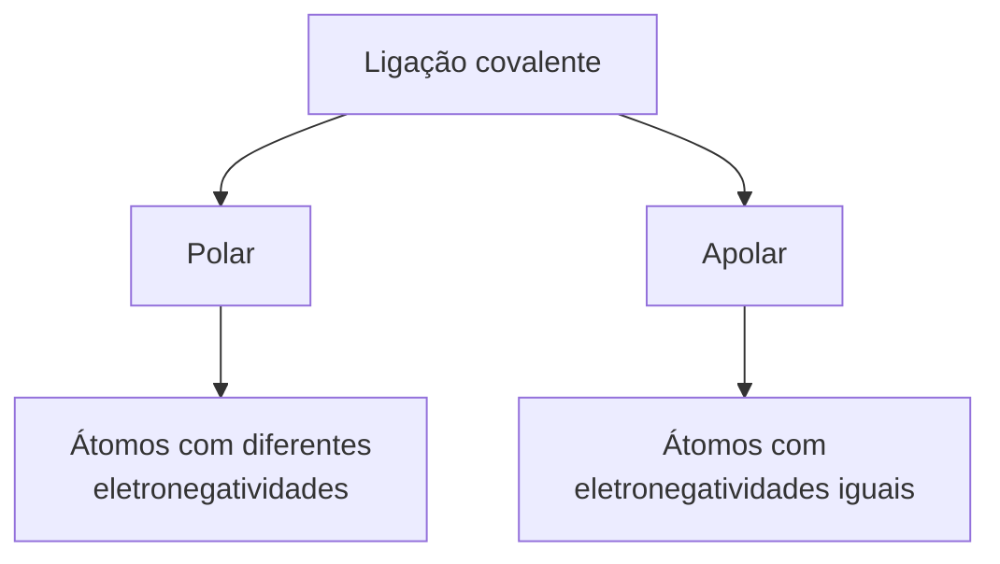
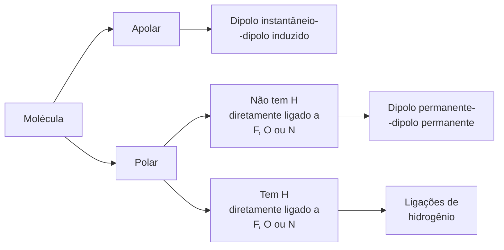

Toda **matéria**, **orgânica** ou **inorgânica**, é composta por pequenas **partículas** chamadas **átomos**. Existem 109 tipos de **átomos** conhecidos, dos quais 89 são naturais e 20 são produzidos em laboratório. Cada tipo de **átomo** é um **elemento químico**.

Segundo o **modelo atômico** atual, todos os **átomos** possuem um _núcleo denso_ cercado por **elétrons**. O _núcleo_, que contém a _maior parte_ da **massa** do **átomo**, é formado por **prótons** e **nêutrons**. **Prótons** têm _carga positiva_ (+1), enquanto **nêutrons** são _neutros_. **Elétrons** têm _carga negativa_ (-1) e **massa** muito _menor_ que **prótons** e **nêutrons**, contribuindo pouco para a **massa** total do **átomo**.

```ad-tip
**Nêutron** é uma **partícula** _sub atômica_ sem **carga elétrica** e de _massa_ praticamente igual à do **próton**.
```

Um **átomo** é _eletricamente neutro_, com o mesmo número de **prótons** e **elétrons**, neutralizando as cargas. Cada **elemento químico** é identificado pelo número de **prótons** no _núcleo_, chamado **número atômico**. Por exemplo, o **hidrogênio** (H) tem um **próton** e **número atômico** 1, enquanto o **carbono** (C) tem seis **prótons** e **número atômico** 6.

![[bio-atomo-resumo.png]]

```ad-info
Os **átomos** de um **elemento químico** podem formar uma ou mais **ligações** com outros **átomos**. O número de **ligações** que um **átomo** pode formar é chamado de **valência química**. Por exemplo, o **hidrogênio** (H) pode formar apenas uma **ligação**, sendo **monovalente**. O **oxigênio** (O) pode formar duas **ligações**, sendo **bivalente**. O **enxofre** (S) também é **bivalente**, enquanto o **nitrogênio** (N) e o **fósforo** (P) são **trivalentes**. O **carbono** (C) pode formar quatro **ligações**, sendo **tetravalente**.
```

```ad-note
**Átomos** e **moléculas** fazem parte de um _mundo microscópico_, quase além de nossa capacidade imaginativa. As menores **partículas** de poeira que somos capazes de ver a olho nu são formadas por um número de **átomos** maior do que o número de estrelas em nossa galáxia. Quando alguém observa uma **célula** viva ao _microscópio óptico_, está observando algo formado por trilhões de **átomos** ou mais.

Só para você ter uma noção de como os **átomos** são pequenos, considere os seguintes dados: se conseguíssemos _enfileirar_ **átomos** de **césio**, de **ouro** ou de **hidrogênio** até que a fileira atingisse 1 cm de _comprimento_, seriam necessários aproximadamente 19 milhões de **átomos** de **césio**, 35 milhões de **átomos** de **ouro** ou 134 milhões de **átomos** de **hidrogênio**!
```
### Número atômico, número de massa e elemento químico
No estudo da Química, são de fundamental importância as definições:
	_a)_ **Número atômico** (Z) é o número de **prótons** presentes no _núcleo_ de um **átomo**.
	_b)_ **Número de massa** (A) é a soma do número de **prótons** (Z) e de **nêutrons** (N) presentes no _núcleo_ de um **átomo**.

```ad-tip
 A fórmula matemática é: A = Z + N.
```

Ao representar um **átomo**, os químicos convencionaram escrever o **número atômico** na parte _inferior esquerda_ do símbolo e o **número de massa** na parte _superior esquerda_. Assim, por exemplo:

- ¹²₆C representa um **átomo** do **elemento químico** **carbono** com 6 **prótons**, 6 **elétrons** e 6 **nêutrons**.
- ²³₁₁Na representa um **átomo** do **elemento químico** **sódio** com 11 **prótons**, 11 **elétrons** e 12 **nêutrons**.
- ³⁷₁₇Cl representa um **átomo** do **elemento químico** **cloro** com 17 **prótons**, 17 **elétrons** e 20 **nêutrons**.
### Isótopos
**Isótopos** são dois ou mais **átomos** que possuem o mesmo **número atômico** (Z) e diferentes **números de massa** (A). O **hidrogênio** é o **elemento químico** com **número atômico** 1. Será que todos os **átomos** de **hidrogênio** que existem na _natureza_ são exatamente _iguais_? A resposta é não.

![[quim-atomo-isobaro.png]]

Os três possuem em comum o **número de prótons** (Z) (e, considerando os _eletricamente neutros_, também o número de **elétrons**). A diferença está no número de **nêutrons**.

```ad-note
Uma vez que possuem o mesmo **número atômico**, são **átomos** de um mesmo **elemento químico**: o **hidrogênio**. Dizemos que esses três **átomos** são **isótopos**.
```

```ad-summary
#### Isóbaros e Isótonos
**Isóbaros** são dois ou mais **átomos** que possuem o _mesmo_ **número de massa** (A) e diferentes **números atômicos** (Z).

**Isótonos** são dois ou mais **átomos** que possuem o _mesmo_ número de **nêutrons** (N) e _diferentes_ **números atômicos** (Z) e **número de massa** (A).
```
## Cargas elétricas, atração e repulsão
Atritando um _bastão de vidro_ em um _pedaço de lã_, pendurando esse _bastão_ com o auxílio de um barbante e, logo após, aproximando-o do _pedaço de lã_, notaremos que ambos se _atraem_. Porém, se em seguida _friccionarmos_ outro _bastão de vidro_ em outro _pedaço de lã_ e aproximarmos esse _bastão_ daquele que está suspenso, notaremos que ambos se _repelem_.

As observações relatadas acima demonstram a ocorrência de _fenômenos elétricos_. Para justificar tal ocorrência, os cientistas consideram que, ao _atritarmos_ ambos os materiais (_lã_ e _vidro_), o _bastão de vidro_ passa a ser portador de **carga elétrica positiva** (por uma convenção), e a _lã_, portadora de **carga elétrica negativa** (também por uma convenção). Muitos materiais, quando atritados em outros, ficam _eletrizados_, ou seja, adquirem **carga elétrica**.

```ad-important
Por meio de experiências de _eletrização_ é possível concluir que:

- **Cargas elétricas** de sinais _diferentes_ se _atraem_.
- **Cargas elétricas** de sinais _iguais_ se _repelem_.
```

Essas conclusões estão de acordo com o fato de a _lã_ e o _vidro_, _eletrizados_ com _cargas_ de _diferentes_ sinais, se _atraírem_, e os dois _bastões de vidro_, _eletrizados_ com _cargas_ de sinais _iguais_, se _repelirem_.

Essa experiência ilustra que a matéria (no caso, o _vidro_ e a _lã_) toma parte em _fenômenos elétricos_, ou seja, a matéria possui uma _natureza elétrica_. 

```ad-note
Outras evidências da _natureza elétrica_ da matéria são as seguintes:
- Se atritarmos um _bastão de vidro_ em um _pedaço de lã_ e o aproximarmos de _pequenos pedaços de papel_, veremos que estes serão _atraídos_ pelo bastão.
- Se friccionarmos um _bastão de vidro_ em um _pedaço de lã_ e o aproximarmos de um _pequeno fio de água corrente_, notaremos que este será _desviado_ na direção do bastão.
```
## Íons
Entre as **partículas** que formam o **átomo**, os **elétrons** possuem **carga negativa** e os **prótons**, **carga positiva**. Assim, se o número de **elétrons** for _igual_ ao número de **prótons**, a _carga total_ do **átomo** será _nula_, pois a **carga positiva** de cada **próton** será _compensada_ pela **carga negativa** de um **elétron** correspondente. Dizemos que um **átomo** nessa situação está _eletricamente neutro_.

Quando um **átomo** está _eletricamente neutro_, ele possui **prótons** e **elétrons** em igual número. Os químicos descobriram que, em determinadas circunstâncias, os **átomos** podem _ganhar_ ou _perder_ **elétrons**. Quando isso acontece, sua _carga total_ deixa de ser _zero_, ou seja, o **átomo** deixa de ser _eletricamente neutro_ e passa a ser dotado de **carga elétrica**. Dizemos que o **átomo** se transformou em um **íon**.

Portanto, quando um **átomo** _eletricamente neutro_ _perde_ ou _recebe_ **elétrons**, ele se transforma em um **íon**. Quando um **átomo** _eletricamente neutro_ _recebe_ **elétrons**, passa a ficar com _excesso_ de **cargas negativas**, ou seja, transforma-se em um **íon negativo**. Já, se um **átomo** _eletricamente neutro_ _perde_ **elétrons**, passa a apresentar um _excesso_ de **prótons**, isto é, transforma-se em um **íon positivo**.

```ad-tip
O **íon negativo** é chamado de **ânion**, e o **íon positivo** é chamado de **cátion**.
```

![[quim-atomo-ions.png]]

Os **íons monovalentes**, isto é, que possuem apenas uma **carga elétrica**, são representados colocando-se um sinal de _mais_ (+) ou de _menos_ (−) no _canto superior direito_ do _símbolo_. O sinal de _mais_ indica um **cátion** e o de _menos_, um **ânion**.

```ad-info
Para representar os **íons bivalentes** (com 2 cargas), **trivalentes** (com 3 cargas) e **tetravalentes** (com 4 cargas), deve-se colocar um número que indica a _quantidade_ de _cargas_ antes do sinal de _mais_ ou de _menos_.
```

Assim, estes são alguns exemplos de íons:
- **Ânions monovalentes:** F⁻, Cl⁻, Br⁻, I⁻
- **Cátions monovalentes:** Li⁺, Na⁺, K⁺, Ag⁺, Cu⁺
- **Ânions bivalentes:** O²⁻, S²⁻, Se²⁻
- **Cátions bivalentes:** Mg²⁺, Ca²⁺, Ba²⁺, Fe²⁺, Cu²⁺
- **Ânions trivalentes:** N³⁻, P³⁻
- **Cátions trivalentes:** Al³⁺, Fe³⁺, Cr³⁺
- **Cátions tetravalentes:** Sn⁴⁺, Pb⁴⁺
## Modelo atômico de Dalton
A palavra **átomo** vem do grego e significa “_indivisível_”. Ela foi usada pela primeira vez por alguns filósofos da Grécia Antiga que, baseados em argumentos filosóficos, propunham que todas as coisas são formadas por **partículas** muito _pequenas_ e _indivisíveis_, os **átomos**.

Alguns pontos importantes da **Teoria de Dalton**, em linguagem moderna, são:
- Todas as **substâncias** são formadas por **átomos**.
- Os **átomos** de um mesmo **elemento químico** são iguais em todas as suas _características_ (por exemplo, **tamanho** e **massa**).
- Os **átomos** dos diferentes **elementos químicos** são diferentes entre si.
- As **substâncias simples** são formadas por **átomos** de um mesmo **elemento químico**.
- As **substâncias compostas** são formadas por **átomos** de dois ou mais **elementos** **químicos** diferentes, que se _combinam_ sempre na mesma _proporção_.
- **Átomos** não são _criados_ nem _destruídos_; são esferas _rígidas_ e _indivisíveis_.
- Nas **reações químicas**, os **átomos** se _recombinam_.
## Modelo atômico de Rutherford
Á medida que novas evidências surgem, _teorias_ e _modelos_ têm, muitas vezes, de ser aperfeiçoados ou substituídos por outros. E foi isso que aconteceu com a **Teoria de Dalton** e seu _modelo_.

Nesse sentido, Ernest Rutherford realizou um experimento que descartou de vez o **modelo atômico de Dalton**. O raciocínio de Rutherford foi extremamente _simples_. Imagine que alguém atirasse com uma _metralhadora_ em um _caixote de madeira fechado_, cujo conteúdo fosse _desconhecido_. Se as balas _ricocheteassem_, não atravessando o _caixote_, concluiríamos que dentro dele deveria haver algum material como _concreto_ ou _ferro maciço_. Mas, se as balas o _atravessassem_, chegaríamos à conclusão de que ele deveria estar _vazio_ ou conter materiais _pouco densos_, como _isopor_ ou _serragem_.

Porém, se parte das balas _passasse_ e parte _ricocheteasse_, concluiríamos que materiais dos dois tipos deveriam estar _presentes_ dentro do _caixote_. Quanto mais balas o atravessassem, menos material _pesado_ deveria existir em seu _interior_. 

É óbvio que, para descobrir o que há dentro de um _caixote_, seria mais sensato abri-lo em vez de _atirar_ nele. Com o **átomo**, porém, não acontece o mesmo, já que não é possível enxergá-lo. Nesse caso, faz sentido “_atirar_” nele para tentar descobrir algo sobre sua _estrutura interna_.

_Rutherford_ atirou numa _finíssima_ folha de **ouro**, cuja _espessura_ se estima em torno de trezentos ou trezentos e cinquenta **átomos**.  A “_metralhadora_” usada por ele lançava _pequenas_ **partículas** portadoras de **carga elétrica positiva**, chamadas de **partículas alfa** (α). Essas **partículas** são emitidas por certos **elementos radioativos**, como o **polônio**.

![[quim-rutherford-2.png]]

Para saber se essas “_balas_” atravessavam ou eram _desviadas_, ele usou uma tela feita com um material apropriado (_fluorescente_) que emite uma _luminosidade instantânea_ quando atingida por uma **partícula alfa**. 

![[quim-rutherford.png]]

```ad-note
A experiência mostrou que a grande maioria das **partículas alfa** atravessava a folha. Apenas algumas poucas eram _desviadas_. Assim, os **átomos** não poderiam ser _maciços_, pois parte das **partículas alfa** conseguiu _atravessá-los_.
```
### Características do átomo no modelo de Rutherford
Os resultados da experiência sobre espalhamento de **partículas alfa** permitiram a Rutherford concluir que:
	_a)_ o **átomo** não é _maciço_, apresentando mais _espaço vazio_ do que _preenchido_;
	_b)_ a maior parte da _massa_ do **átomo** se encontra em uma pequena região central (que chamaremos de _núcleo_) dotada de **carga positiva**, onde estão os **prótons**;
	_c)_ na região ao redor do _núcleo_ (que chamaremos de **eletrosfera**) estão os **elétrons**, _muito_ mais _leves_ que os **prótons**;
	_d)_ a contagem do número de **partículas** que atravessavam e que eram desviadas, _repelidas_ pela **carga positiva** do _núcleo_, permitiu fazer uma estimativa de que o _raio_ de um **átomo** de **ouro** (_núcleo_ e _eletrosfera_) é cerca de dez mil a cem mil vezes maior que o _raio_ do _núcleo_.

![[quim-rutherford-3.png]]
## Modelo Atômico de Bohr
O **modelo de Rutherford**, apesar de esclarecer satisfatoriamente os resultados da experiência sobre a _dispersão_ de **partículas alfa**, possuía algumas _deficiências_, como, por exemplo, a incapacidade de explicar os **espectros atômicos**. Niels Bohr propôs um novo _modelo_, mais _completo_, que era suficiente para explicar o **espectro de linhas**.

Em seu _modelo_, Bohr incluiu uma série de afirmações:
	_a)_ Os **elétrons** nos **átomos** movimentam-se ao redor do _núcleo_ em _trajetórias circulares_, chamadas de _camadas_ ou _níveis_ (designados por K, L, M, N etc.). Cada um desses _níveis_ tem um valor determinado de **energia**.
	_b)_ Não é permitido a um **elétron** permanecer entre dois desses níveis. Um **elétron** pode passar de um **nível** para outro de _maior_ **energia**, desde que _absorva_ **energia** _externa_ (**ultravioleta**, luz visível, **infravermelho** etc.). Quando isso acontece, dizemos que o **elétron** foi _excitado_ e ocorreu uma **transição eletrônica** (veja a ilustração A).
	_c)_ Para o **elétron** retornar ao nível inicial, é necessária a _liberação_ de **energia** na forma de **ondas eletromagnéticas** (veja a ilustração B), por exemplo, como luz visível ou **ultravioleta**.

![[quim-bohr-1.png]]
Utilizando o **modelo de Bohr**, podem-se explicar os **espectros atômicos**. Primeiramente, os **elétrons** são _excitados_ na _lâmpada de gás_ e, em seguida, ao retornarem aos _níveis_ de _menor_ **energia**, liberam **energia** na forma de _luz_. Como a _cor_ da _luz_ emitida depende da diferença de **energia** entre os _níveis_ envolvidos na _transição_ (veja a ilustração C), e como essa diferença varia de **elemento** para **elemento**, a _luz_ apresenta uma _cor_ característica para cada **elemento químico**.
![[quim-bohr-2.png]]
## Elementos químicos
Provavelmente você já deve ter ouvido falar que a _fórmula_ da **água** é H₂O. Outros exemplos de _fórmulas_ usadas pelos químicos são CO₂ (gás carbônico), N₂ (gás nitrogênio), O₂ (gás oxigênio), O₃ (gás ozônio), C₂H₆O (etanol), C₆H₁₂O₆ (glicose), NH₃ (amônia) e CH₄ (gás metano).

Todas as **substâncias** são formadas por **átomos**. As **substâncias simples** são formadas por **átomos** de um _único_ **elemento** e as **substâncias compostas**, por **átomos** de dois ou mais **elementos** diferentes.

As **moléculas** são as _menores unidades_ que apresentam a composição característica de uma **substância**. As **moléculas** são formadas por **átomos**.

Para representar as **moléculas** de uma **substância**, seja ela **simples** ou **composta**, os químicos utilizam _fórmulas_. Na _fórmula_ de uma **substância**, são colocados os _símbolos_ dos **elementos** que fazem parte de sua _composição_ e _números_, os **índices de atomicidade**, que indicam a _proporção_ em que os **átomos** do **elemento** estão presentes na **substância**. 

```ad-info
Se o **índice de atomicidade** não for escrito, é porque seu _valor_ é 1.
```

Assim, por exemplo:
- A _fórmula_ O₂ representa a **substância** cujas **moléculas** são formadas por dois **átomos** do **elemento químico** **oxigênio**.
- A _fórmula_ O₃ representa a **substância** cujas **moléculas** são formadas por três **átomos** do **elemento químico** **oxigênio**.
- A _fórmula_ H₂O representa a **substância** cujas **moléculas** são formadas por dois **átomos** do **elemento químico** **hidrogênio** e um **átomo** do **elemento químico** **oxigênio**.
### Equação química
Voltemos ao exemplo da **decomposição** da **água**. Levando em conta a _composição_ das **moléculas** envolvidas, podemos representar essa **reação** assim: 
$$
\text{Água} \rightarrow \text{Hidrogênio} + \text{Oxigênio}
$$

A **água**, o **reagente**, é formada por **moléculas** H₂O; o **hidrogênio** e o **oxigênio**, os **produtos**, têm _fórmulas_ H₂ e O₂, respectivamente. Assim, poderíamos representar a **reação** usando as _fórmulas_ do **reagente** e dos **produtos**:
$$
H_2O \rightarrow H_{2}+ O
$$
Nessa representação, falta, porém, a _proporção_ correta entre as _quantidades_ de **moléculas** envolvidas. Uma representação mais correta é:
$$
H_{2}O+ H_{2}O \rightarrow H_2+H_{2}+O_2
$$
ou seja, isso é a mesma coisa que:
$$
2H_2O\rightarrow 2H_2+O_2
$$
```ad-info
Em outras palavras, duas **moléculas** de **água** _reagem_ para formar duas **moléculas** de **hidrogênio** e uma de **oxigênio**.
```

Agora, sim, está expressa a verdadeira _proporção_ entre as _quantidades_ de **moléculas** que participam da **reação**. Essa maneira de representar uma **reação química** é denominada **equação química**. O exemplo que acabamos de ver é a **equação química** que representa a **decomposição** da **água**. Os _números_ que indicam a _proporção_ entre as _quantidades_ de **moléculas**, numa **equação química**, são chamados de **coeficientes estequiométricos**. Na **equação** acima, o _coeficiente_ da **água** é 2, o do **hidrogênio** é 2 e o do **oxigênio** é 1 (que não precisa ser escrito).
#### Balanceamento de equações químicas
Analisando os exemplos de **equações químicas** mostrados anteriormente, é possível perceber que o _número_ de **átomos** de certo **elemento químico** é igual nos **reagentes** e nos **produtos**. Isso porque os **átomos** não são _destruídos_ nem _criados_, de acordo com a **lei de Lavoisier**,  numa **reação química**. Quando escrevemos uma **equação química**, ela deve estar corretamente _balanceada_, ou seja, os _coeficientes_ devem estar corretamente indicados. Caso contrário, não estará sendo respeitado o fato de o número de **átomos** se conservar. 

Por exemplo, a **equação química**:
$$
N_2 + O_{2} \rightarrow NO
$$
não está corretamente _balanceada_, pois há menos **átomos** de N e de O no lado do **produto**. Contudo, essa **equação** ficará corretamente _balanceada_ se colocarmos o _coeficiente_ 2 na frente da _fórmula_ do **produto**:
$$
N_2 + O_{2} \rightarrow 2NO
$$
## Ligações químicas
Um passo importante para entender as **ligações químicas** é agrupar **substâncias** de acordo com _características_ específicas:
	_a)_ Primeiro grupo — **substâncias** que _conduzem_ a **corrente elétrica** no **estado líquido**, mas não no **sólido**. Por exemplo, cloreto de **lítio**, brometo de **potássio**, cloreto de **cálcio**, cloreto de **sódio**, óxido de **alumínio** e óxido de **magnésio**.
	_b)_ Segundo grupo —  **substâncias** que _não conduzem_ **corrente elétrica** no **estado sólido** nem no **líquido**; também se destacam por apresentar **pontos de fusão** significativamente mais _baixos_ que as **substâncias** dos outros dois grupos. Inclui **etanol**, cloro, **água**, naftaleno, **iodo** e **glicose**.
	_c)_ Terceiro grupo — **substâncias** que _conduzem_ **corrente elétrica** tanto no **estado sólido** quanto no **líquido**; quanto aos **pontos de fusão**, essas **substâncias** são razoavelmente _comparáveis_ às do primeiro grupo. Inclui **alumínio**, **prata**, **ouro**, **cobre**, **ferro** e **platina**.

As do primeiro grupo têm em sua _composição_ simultaneamente **metal** e **não metal**. Essas **substâncias** são denominadas **substâncias iônicas**. As do segundo grupo apresentam apenas **elemento(s)** do tipo **não metal**. São chamadas **substâncias moleculares**. As do terceiro grupo apresentam apenas **metal** em sua _composição_. São as **substâncias metálicas**.

A **ligação química** é a _união_ entre **átomos**. Ela pode ser de três tipos: **iônica**, **covalente** e **metálica**. Desse modo podemos classificar os grupos como:
- primeiro grupo, os **átomos** se unem por **ligação iônica**;
- segundo grupo, os **átomos** se unem por **ligação covalente**;
- terceiro grupo, os **átomos** se unem por **ligação metálica**.

```ad-summary
##### Os gases nobres e a regra do octeto
Dos milhões de **substâncias** conhecidas, sabe-se de apenas _seis_ nas quais existem **átomos** não unidos a outros **átomos**. Essas **substâncias** são o **hélio**, o **neônio**, o **argônio**, o **criptônio**, o **xenônio** e o **radônio**, **gases** presentes em _pequena quantidade_ na **atmosfera** terrestre. Esses **gases** são formados por **átomos** _não unidos_ dos **elementos** do grupo 18 da **tabela periódica**, o grupo dos **gases nobres**.Além disso, até hoje não foi descoberta sequer uma **substância** natural na qual **átomos** de **gases nobres** estejam _unidos_ a **átomos** de outros **elementos**. 


Ao contrário de todos os outros **elementos**, os **gases nobres** apresentam a **última camada** contendo 8 **elétrons**, com exceção do **hélio**, no qual a **última camada** só comporta 2. Tudo indica, portanto, que possuir 8 **elétrons** na **última camada** (ou 2, caso seja a **camada K**) faz com que o **átomo** fique _estável_, essa afirmação constitui a **regra do octeto**.
```
### Ligação iônica
Vamos, agora, elaborar ideias sobre _perda_ e _recebimento_ de **elétrons** por um **átomo**. Considere os **elementos** do _segundo período_ da **tabela periódica**:

| Elemento                      | ₃Li | ₄Be | ₅B  | ₆C  | ₇N  | ₈O  | ₉F  | ₁₀Ne |
| ----------------------------- | --- | --- | --- | --- | --- | --- | --- | ---- |
| Nº de **prótons**             | 3   | 4   | 5   | 6   | 7   | 8   | 9   | 10   |
| Nº de **camadas eletrônicas** | 2   | 2   | 2   | 2   | 2   | 2   | 2   | 2    |
```ad-info
Os **átomos** de todos eles apresentam duas **camadas** com **elétrons**, pois são **elementos** do _segundo período_ da **tabela periódica**. O que mantém os **elétrons** _presos_ ao **átomo** é a _atração_ exercida pelos **prótons** do _núcleo_, de **carga positiva**.
```

No **átomo** de **lítio**, o **elétron** da **camada de valência**  é _atraído_ por 3 **cargas positivas** do _núcleo_. No **berílio**, os **elétrons** de **valência** são _atraídos_ por 4 **cargas positivas** e assim por diante até o **neônio**, no qual cada **elétron** da **última camada** é _atraído_ por 10 **cargas positivas**. 

O que isso sugeriu aos químicos? À medida que vamos do **lítio** para o **neônio**, os **elétrons** da **camada de valência** estão mais presos ao **átomo**. Em outras palavras, nessa sequência, o **lítio** é o **átomo** que pode perder um **elétron** com _mais facilidade_ e o **neônio** é o que perderia um **elétron** com _maior dificuldade_.

Consideremos, agora, os **átomos** de **elementos** do _terceiro período_:

| Elemento                      | ₁₁Na | ₁₂Mg | ₁₃Al | ₁₄Si | ₁₅P | ₁₆S | ₁₇Cl | ₁₈Ar |
| ----------------------------- | ---- | ---- | ---- | ---- | --- | --- | ---- | ---- |
| Nº de **prótons**             | 11   | 12   | 13   | 14   | 15  | 16  | 17   | 18   |
| Nº de **camadas eletrônicas** | 3    | 3    | 3    | 3    | 3   | 3   | 3    | 3    |
Nessa sequência vale uma conclusão análoga: o **sódio** é o **elemento** cujo _núcleo_ exerce _menor atração_ sobre o **elétron** de **valência** e o **argônio** é o que _exerce_ a _maior_. Podemos generalizar essa discussão da seguinte maneira: à medida que percorremos um _período_ da **tabela periódica**, da esquerda para a direita, aumenta a _atração_ exercida pelo _núcleo_ sobre os **elétrons** da **camada de valência**.

```ad-note
 De fato, os químicos perceberam que os **átomos** dos **elementos** dos _grupos_ _1_, _2_ e _13_ apresentam uma tendência acentuada a _perder_ os **elétrons** da **camada de valência**.
```

Sem os **elétrons** de **valência**, a **última camada eletrônica** passa a ser a anterior, que _satisfaz_ a **regra do octeto**. Assim, por exemplo, **átomos** de **sódio**, sob determinadas condições, podem _perder_ o **elétron** de **valência**, **átomos** de **magnésio** podem _perder_ os dois **elétrons** de **valência** e **átomos** de **alumínio** podem _perder_ os três.

Os químicos também verificaram que os **átomos** dos **elementos** dos _grupos 15_, _16_ e _17_ apresentam, de modo geral, tendência a _receber_ **elétrons** para ficar com oito **elétrons** na **última camada**. Assim, **átomos** de **ferro** e de **cloro**, sob determinadas condições, podem _receber_ um **elétron**, **átomos** de **oxigênio** e **enxofre** podem _receber_ dois e **átomos** de **nitrogênio** ou **fosforo** podem _receber_ três.

```ad-note
 A discussão apresentada foi generalizada pelos químicos da seguinte maneira: **metais** têm tendência a _formar_ **cátions**; e **não metais**, a _formar_ **ânions**.
```

```ad-important
As **substâncias** formadas por **metais** e **não metais** apresentam _elevados_ **pontos de fusão** e de **ebulição**, _conduzem_ **corrente elétrica** no **estado líquido**, mas não no **estado sólido**. Além disso, o **composto iônico** tende a ser **sólido** nas _condições ambientes_ de **pressão** e _temperatura_.
```
#### Formação de íons 
Consideremos **átomos** _neutros_ dos **elementos** **sódio** e **cloro**:
- ₁₁Na: K–2 L–8 M–1
- ₁₇Cl: K–2 L–8 M–7  

Nenhum deles está _estável_, de acordo com a **regra do octeto**. Contudo, se houver uma _transferência_ de 1 **elétron** do **sódio** para o **cloro**, ambos atingirão a _estabilidade_:
- ₁₁Na⁺: K–2 L–8
- ₁₇Cl⁻: K–2 L–8 M–8  

Esse processo pode ser esquematizado simplificadamente, representando-se por bolinhas os elétrons da última camada (a camada de valência) ao redor do símbolo do elemento:

![[quim-ionica-doando.png]]

Os **íons** Na⁺ e Cl⁻ possuem **cargas elétricas** _opostas_; portanto, se _atraem_ mutuamente. Essa _atração_ mantém os **íons** unidos, formando uma **substância** muito conhecida, o **cloreto de sódio** (comercializado como sal de cozinha), representado pela _fórmula_ NaCl. Tal união é chamada de **ligação iônica**.

```ad-warning
**Metais** têm tendência a _formar_ **cátions**; e **não metais**, a _formar_ **ânions**.
```

Assim,  **átomos** do **metal** **sódio** e do **não metal** **cloro** podem se _unir_ quimicamente formando o **cloreto de sódio** (NaCl). O **cloreto de sódio** é apenas um exemplo de **composto iônico**, ou seja, um composto formado por **íons**. De modo geral, sempre que um **elemento**, que necessite _doar_ **elétrons** para se _estabilizar_, se _unir_ a outro, que necessite _recebê-los_, a _união_ se dará por **ligação iônica**.

```ad-note
Em processos químicos, **elétrons** não são _criados_ nem _destruídos_. Assim, o total de **elétrons** _doado_ deve ser igual ao total _recebido_. Em outras palavras, a _carga total positiva_ no composto formado deverá ser igual à _negativa_, o que o tornará _eletricamente neutro_ como um todo.
```
#### Escrevendo a fórmula de um composto iônico
Os **elementos** dos _grupos_ _1_, _2_ e _13_ da **tabela periódica**, que são **metais**, apresentam 1, 2 e 3 elétrons, respectivamente, na **camada de valência**. Para ficarem _estáveis_, de acordo com a **regra do octeto**, deverão _perder_ esses **elétrons**. Já os elementos dos _grupos_ _15_, _16_ e _17_, predominantemente **não metais**, deverão _receber_ o número de **elétrons** que falta para completar a **regra do octeto**.
![[quim-ionica-complementar.png]]

Para escrever a _fórmula_ de um **composto iônico**, é preciso descobrir qual a _carga_ do **íon** _estável_ formado pelos **elementos** presentes. A seguir, utilize a seguinte regra prática:
![[quim-ionica-formula.png]]
Por exemplo:
![[quim-ionica-formula-2.png]]

Esta regra se fundamenta no seguinte fato: num **composto**, a _carga elétrica total positiva_ deve ser igual à _negativa_, resultando _carga total nula_.

```ad-note
O _módulo da carga_ de um **íon** é chamado de **valência** desse **íon**. Assim, por exemplo, Na⁺ é um **cátion monovalente**; O²⁻ é um **ânion bivalente**; e Al³⁺ é um **cátion trivalente**.
```

```ad-summary
##### Hidrogênio não é Metal!
O **hidrogênio** apresenta apenas 1 **elétron**. Para ficar com **eletrosfera** de **gás nobre** (igual à do **hélio**, que possui 2 **elétrons**), ele precisa _receber_ 1 **elétron**. Assim, em **ligação iônica**, o **hidrogênio** apresenta **carga negativa**. 

Apesar de estar localizado no _grupo 1_ da **tabela periódica**, o **hidrogênio** se assemelha muito mais aos **halogênios**, pois apresenta tendência a, como eles, _receber_ **elétrons**. O **hidrogênio** não é um **metal alcalino**. O **íon** H⁻ é chamado de **íon hidreto**.
```
### Ligação covalente 
**Ligação covalente** é basicamente o _compartilhamento_ de **elétrons**, mas como podemos explicar a _união_ entre **átomos** de um ou mais **elementos químicos** que precisem _receber_ **elétrons**?
![[quim-covalente-cl-eletronica.png]]
```ad-note
Representação de um **átomo** de **cloro**, com seus 7 **elétrons** na **camada de valência**.
```

```ad-info
O **átomo** de **cloro** precisa de mais 1 **elétron** para adquirir a _estabilidade_ de acordo com a **regra do octeto**.
```

Foi proposto que, na **substância** Cl₂, os **átomos** se mantêm _unidos_ porque suas **eletrosferas** _compartilham_ alguns **elétrons** da **última camada**. _Compartilhar_, nesse caso, significa que alguns **elétrons** passam a fazer parte da **camada de valência** dos dois **átomos ligados**. _Compartilhando_ **elétrons**, eles passam a se adequar a **regra do octeto**.
![[quim-covalente-compartilhando.png]]

Nenhum dos **átomos** envolvidos transformou-se em **íon**, ou seja, nenhum deles _perdeu_ ou _recebeu_ **elétrons**. Devido ao _compartilhamento_, todos passaram a ter, em suas **eletrosferas**, número de **elétrons** igual ao dos **gases nobres**.

```ad-tip
**Substâncias** formadas pela _união_ de **átomos** de **não metais** (incluindo o **hidrogênio**) apresentam **pontos de fusão** e **ebulição** relativamente _baixos_ e _não conduzem_ **corrente elétrica** nos estados **líquido** ou **sólido**. 
```

Vamos examinar agora os casos das **substâncias** H₂, O₂ e N₂. Procurando os **elementos** H, O e N na **tabela periódica**, determinamos quantos **elétrons** apresentam na **camada de valência**.

![[quim-covalente-compartilhando-2.png]]
Quando **átomos** se _unem_ por _compartilhamento_ de **elétrons**, dizemos que entre eles se estabelece **ligação covalente**. Os grupos de **átomos** _unidos_ por **ligação covalente** são denominados **moléculas**.

Três maneiras distintas de representar uma molécula são:
	_a)_ **Fórmula molecular**: Indica o número e o tipo de **átomos** em uma **molécula**.
	_b)_ **Fórmula eletrônica**: Representa os **elétrons** da **camada de valência** e mostra como são _compartilhados_.
	_c)_ **Fórmula estrutural**: Representa cada par de **elétrons** _compartilhado_ por meio de um _tracinho_.

![[quim-covalente-formulas.png]]

```ad-note
Nas **moléculas** de Cl₂ e de H₂, diz-se que há uma **ligação covalente simples**. Na **molécula** de O₂, diz-se que há duas **ligações covalentes** ou uma **ligação covalente dupla**. E na **molécula** de N₂, diz-se que há três **ligações covalentes** ou uma **ligação covalente tripla**.
```

```ad-summary
##### Diferença entre ligação covalente e iônica

É importante que você perceba as diferenças fundamentais entre as **ligações iônica** e **covalente**:

Na **ligação iônica**, **elétrons** são _transferidos_, formando **cátions** e **ânions** que se _unem_ compondo um **retículo cristalino iônico**. Nele, os **íons** se acham fortemente _unidos_, formando um composto **sólido**.

Na **ligação covalente**, os **átomos** não _doam_ nem _recebem_ **elétrons**, não ocorrendo a formação de **íons**. Os **átomos** se _unem_ _compartilhando_ **elétrons** e formando **moléculas**.
```
### Ligações covalentes adicionais usando par eletrônico de um mesmo átomo
Considere o **composto** de **fórmula molecular** SO₂, um _poluente atmosférico_ comum nas grandes cidades. Suas **moléculas** podem ser representadas da seguinte forma:
![[quim-covalente-compartilhamento-3.png]]

Como você pode perceber, uma dessas **ligações** foi feita por meio do _compartilhamento_ de dois **elétrons** provenientes de apenas um dos **átomos** envolvidos, o **enxofre**. Na **regra do octeto**, não há restrição alguma a isso. 

```ad-important
Uma **ligação covalente** pode ser estabelecida com um par de **elétrons** _compartilhado_, qualquer que seja a origem desse par de **elétrons**.
```

```ad-summary
##### Por que os elétrons compartilhados mantêm os átomos unidos?
Os _núcleos_ dos **átomos** que se _unem_ para formar uma **molécula** se _repelem_, pois possuem **cargas elétricas** de mesmo _sinal_. Um **elétron** presente entre esses dois _núcleos_ _atrairá_ ambos, pois _núcleo_ e **elétron** possuem cargas de _sinais opostos_. A presença dos **elétrons** acarreta uma _atração_ suficientemente intensa para manter os _núcleos_ unidos, apesar da _repulsão_ entre eles.

![[quim-covalente-uniao.png]]
```

```ad-note
Algumas **substâncias moleculares** são **gasosas** nas condições ambientes. Outras são **líquidas** e outras, **sólidas**.

Como se pode explicar, em nível microscópico, o fato de existirem **substâncias moleculares** pertencentes aos três **estados físicos**? A resposta está ligada à _união_ que existe entre as **moléculas**. Numa **substância gasosa**, as **moléculas** estão muito _fracamente unidas_; num **líquido**, elas estão mais _fortemente unidas_ e, num **sólido**, estão ainda mais _intensamente unidas_.

![[quim-covalente-uniao-diferentes.png]]

A _união_ entre as **moléculas** se deve às **ligações químicas intermoleculares**, isto é, _interações atrativas_ entre as **moléculas**.
```
### Ligação metálica
Uma vez que os **metais** são bons _condutores_ de **corrente elétrica**, é de se esperar que possuam em sua estrutura **elétrons** _livres_ para se movimentarem. Essa é uma das evidências que levaram à elaboração do _modelo_ da **ligação química** existente nos **metais**.

Como já vimos, os **núcleos** dos **átomos** dos **elementos** classificados como **metais** não exercem uma _atração_ muito _forte_ sobre os **elétrons** da **última camada**. Por isso, possuem alta tendência a _perder_ **elétrons**. Dessa forma, os cientistas admitem que um **metal** **sólido** é constituído por **átomos** em _posições ordenadas_ com seus **elétrons de valência** _livres_ para se movimentarem por todo o **metal**. Assim, temos um “_amontoado_” organizado de **íons** _metálicos_ _positivos_ mergulhados em um “_mar de elétrons_” livres. Esse é o chamado modelo do “_mar de elétrons_”, que explica a _condutividade elétrica_ dos **metais**. 

Assim como a presença dos **elétrons** entre dois **átomos** os mantém _unidos_ numa **ligação covalente**, é a presença do “_mar de elétrons_” que mantém os **átomos** _metálicos_ _unidos_ em um tipo de **ligação química** denominado **ligação metálica**. 

```ad-important
Contudo, em um _pedaço de metal_, os **átomos** não se encontram com o **octeto** completo. Desse modo, a **regra do octeto** _não é satisfatória_ para explicar a **ligação metálica**.
```

Se ampliarmos um _pedaço de metal_, veremos algo como o que aparece na figura A, abaixo: um _mosaico_ composto de vários _pedacinhos_ do mesmo _metal_. Cada um deles consiste em um pequeno **retículo cristalino metálico** formado por milhares de milhões de **átomos**. 
![[quim-metalica.png]]
```ad-note
_A)_ Visão ao _microscópio_ do corte de um _pedaço de metal_. 

B) Ampliação esquemática da junção entre três **cristais metálicos** presentes em um pedaço da **substância**. Todas as _bolinhas_, independentemente da _cor_, representam **átomos** do mesmo _metal_. _Cores_ diferentes foram usadas para representar os **átomos** que pertencem a cada um dos três **retículos cristalinos metálicos**.
```

```ad-summary
##### Ligações e a condutividade elétrica

As **substâncias metálicas** conduzem **corrente elétrica** no estado **sólido** graças a seus **elétrons** _livres_. Quando passam para o estado **líquido** (isto é, são fundidas, derretidas, sofrem **fusão**), os **elétrons** continuam _livres_ para _conduzir_ **corrente elétrica**.

![[quim-metalica-condutividade.png]]

**Moléculas** não possuem **carga elétrica**, ou seja, são _eletricamente neutras_. Assim, as **substâncias moleculares** não apresentam **cargas livres** e, portanto, são incapazes de _conduzir_ **corrente elétrica**.

![[quim-covalente-condutividade.png]]

**Íons** são entidades possuidoras de **carga elétrica**, isto é, não são _eletricamente neutros_. **Substâncias iônicas** _conduzem_ **eletricidade** no estado **líquido**, pois, nessas circunstâncias, os **íons** que as constituem não estão _presos_ em um **retículo cristalino**, mas _livres_ para se movimentarem. No estado **sólido**, ao contrário, as substâncias **iônicas** não _conduzem_ **corrente elétrica** porque os **íons** não estão _livres_ para se movimentarem. No estado **sólido**, esses **íons** estão presos (“_travados_” no lugar), formando o **retículo cristalino iônico**, como mostra a figura a baixo.

![[quim-ionica-condutividade.png]]
```
#### Propriedades das substâncias metálicas
**Alta condutividade térmica e elétrica**: Essas propriedades se devem aos **elétrons** _livres_. Seu movimento ordenado constitui a **corrente elétrica** e sua _agitação_ permite a _rápida propagação_ do **calor** através dos _metais_.

**Altos pontos de fusão e de ebulição**: Em geral, são _características_ dos _metais_ (embora haja exceções, como **mercúrio**, PF = -39 °C; **gálio**, PF = 30 °C; e **potássio**, PF = 63 °C). Devido a essa _propriedade_ e também à boa _condutividade térmica_, alguns _metais_ são usados em panelas e em radiadores de automóveis.

**Maleabilidade**: _Metais_ são muito _maleáveis_, ou seja, fáceis de transformar em lâminas. O _metal_ mais maleável é o **ouro**, que permite obter as lâminas mais finas (com espessuras da ordem de até 0,00001 cm!).

**Ductibilidade**: _Metais_ também são muito _dúcteis_, isto é, fáceis de transformar em fios. O **ouro** é também o mais dúctil dos _metais_, permitindo que se obtenham fios finíssimos (1 g fornece 2.000 m de fio!).

**Resistência à tração**: O **ferro**, sob a forma de **aço**, é um exemplo de _metal_ que apresenta grande resistência à _tração_. Isso significa que, quando se tenta _esticar_ um _cabo_ ou uma _barra_ de **ferro**, eles suportam uma _força_ muito grande, e só arrebentam se a _força_ ultrapassar determinado valor. Essa _propriedade_ permite sua utilização em _cabos_ de elevadores e na construção civil, na mistura com o concreto, formando o chamado _concreto armado_.

```ad-summary
##### Diferença entre as ligações
|Substância|Pontos de fusão e ebulição|Estado físico nas condições ambientes|Conduz corrente elétrica no estado sólido?|Conduz corrente elétrica no estado líquido?|
|---|---|---|---|---|
|Iônica|Altos|Sólido|Não|Sim|
|Molecular|Baixos|Sólido, líquido ou gasoso|Não|Não|
|Metálica|Altos|Sólido|Sim|Sim|
```
## Geometria molecular
Quando **átomos** de **não metais** se _unem_, eles o fazem por meio de uma ou mais **ligações covalentes**. Como consequência dessa _união_, surgem **moléculas** com dois ou mais **átomos**. A **geometria molecular** descreve como os **núcleos** dos **átomos** que constituem a **molécula** estão _posicionados_ uns em relação aos outros. 
![[quim-geometria-moleculas.png]]

```ad-info
Nesses _modelos_, cada _bolinha_ representa um **átomo** e cada _vareta_ representa uma ou mais **ligações covalentes**. 
```

Por meio de técnicas avançadas, os químicos determinaram a _geometria_ de várias **moléculas**. Alguns exemplos são:

- **HCN** — linear
- **CH₄** — tetraédrica
- **CO₂** — linear
- **NH₃** — piramidal
- **CH₂O** — trigonal plana
- **H₂O** — angular
- **SO₂** — angular
### Polaridade de ligações
Considere uma **molécula** de HF. O par de **elétrons** _compartilhado_ não é _atraído_ igualmente por ambos os **átomos**, uma vez que o **flúor** é mais **eletronegativo** que o **hidrogênio**. 
![[quim-polaridade-atracao-polar.png]]

Embora o par de **elétrons** seja _compartilhado_, ele se encontra mais _deslocado_ em direção ao **flúor**. Dizemos que no **flúor** aparece uma _carga parcial negativa_ (simbolizada por δ-) e no **hidrogênio** uma _carga parcial positiva_ (simbolizada por δ+). A **ligação** entre H e F é chamada de **ligação covalente polar**, pois nela existem dois **polos elétricos**, um _negativo_ e outro _positivo_. 

![[quim-polaridade-ligacao-polar-2.png]]

Considere, agora, o caso da **molécula** de H₂. Como ambos os **átomos** presentes possuem a mesma **eletronegatividade**, não há **polarização** da **ligação**, e dizemos que se trata de uma **ligação covalente apolar**.

```ad-warning
Uma **ligação covalente** será **polar** se os dois **átomos** que estabelecem essa **ligação covalente** possuírem _diferentes_ **eletronegatividades**.

Uma **ligação covalente** será **apolar** se os dois **átomos** que estabelecem essa **ligação covalente** tiverem **eletronegatividades** _iguais_.
```



```ad-summary
##### Eletronegatividade
Denomina-se eletronegatividade a tendência que o átomo de um determinado elemento apresenta para atrair elétrons, num contexto em que se acha ligado a outro(s) átomo(s). Embora essa atração ocorra sobre todo o ambiente eletrônico que circunda o núcleo do átomo, é de particular interesse a atração que ele exerce sobre os elétrons envolvidos na ligação química.
```
#### Ligação iônica versus ligação covalente
Considere as **ligações** esquematizadas a baixo, cada qual acompanhada do respectivo valor de _diferença_ (representado por Δ) entre as **eletronegatividades** de ambos os **átomos**. Como pode-se perceber, à medida que a diferença de **eletronegatividade** _aumenta_, os **elétrons** passam a ser cada vez mais predominantemente _atraídos_ por um dos **átomos**. 

![[quim-polaridade-ion-cov.png]]


```ad-note
A **ligação iônica** pode ser encarada como um _caso extremo_ da **ligação covalente polar**, em que a _diferença_ de **eletronegatividade** é tão _grande_ que o **elétron** é transferido de um **átomo** para outro em vez de ser _compartilhado_ por ambos.
```

```ad-summary
##### Polaridade e solubilidade
Para entender melhor a _relação_ entre **polaridade** e _solubilidade_ olha a imagem de três copos um pouco de **água** e **etanol**, **gasolina** e **querosene**, e **água** e **gasolina**, respectivamente. 

![[quim-polaridade-solubilidade.png]]

Lembrando que **água** e **etanol** são **polares** e que **gasolina** e **querosene** são **apolares**, os resultados experimentais relatados acima permitem ilustrar uma _tendência_ geral que se observa:

_a)_ **Soluto polar** tende a se _dissolver_ bem em **solvente polar**.
_b)_ **Soluto apolar** tende a se _dissolver_ bem em **solvente apolar**.
_c)_ Quando o **solvente** é **polar** e o **soluto apolar**, ou vice-versa, não existe tendência para que haja _solubilização_. Isso explica, por exemplo, o fato de a **gasolina** não se _dissolver_ bem em **água**.
```
## Forças intermoleculares
No **estado gasoso**, as **moléculas** se encontram bastante _separadas_, movimentando-se com _muita_ _liberdade_. Já no **estado líquido**, elas se encontram mais _próximas_ e _unidas_, movimentando-se com _menor_ _liberdade_. No **estado sólido**, as **moléculas** estão bem _organizadas_ e ainda mais _unidas_, com seu movimento _muito restrito_.

O que mantém as **moléculas** _unidas_ nos estados **sólido** e **líquido** são as chamadas **ligações ou forças ou interações intermoleculares**. Elas são fundamentalmente de três tipos: **interações dipolo permanente-dipolo permanente**, **ligações de hidrogênio** e **interações dipolo instantâneo-dipolo induzido**.

![[quim-forças-intermeoleculares.png]]

|                                           | Gasoso                                                    | Liquido                                                                                                         | Sólido                                                                                                                         |
| ----------------------------------------- | --------------------------------------------------------- | --------------------------------------------------------------------------------------------------------------- | ------------------------------------------------------------------------------------------------------------------------------ |
| Propriedades<br>macroscópicas             | Volume variável<br>Forma variável                         | Volume fixo<br>Forma variável                                                                                   | Volume fixo<br>Forma definida                                                                                                  |
| Atração que mantém<br>as moléculas unidas | Muitíssimo fraca                                          | Forte                                                                                                           | Mais forte que<br>no líquido                                                                                                   |
| Espaço entre<br>as moléculas              | Muito grande (várias ve-<br>zes maior que no líquido)     | Pequeno                                                                                                         | Em geral, menor<br>que no líquido                                                                                              |
| Organização<br>das moléculas              | Total desordem, com<br>movimento caótico das<br>moléculas | Cada molécula<br>está livre para<br>se movimentar,<br>mas sempre<br>sob influência<br>das moléculas<br>vizinhas | As moléculas<br>estão rela-<br>tivamente<br>“presas” em<br>suas posições,<br>formando um re-<br>tículo cristalino<br>molecular |


### Interações dipolo permanente-dipolo permanente
Considere uma **molécula** de HCl. Devido à _diferença_ de **eletronegatividade** entre H e Cl, essa **molécula** é **polar**. Sua _extremidade negativa atrai_ a _extremidade positiva_ de outra **molécula** vizinha, e o mesmo ocorre com sua _parte positiva_, que interage _atrativamente_ com a _parte negativa_ de outra **molécula** vizinha. Essa _força de atração_ entre os **dipolos** das **moléculas** é chamada de **interação dipolo-dipolo** ou interação **dipolo permanente-dipolo permanente**.
![[quim-forças-dipolo.png]]
Assim, no HCl **líquido** ou **sólido**, são essas as _forças_ que mantêm as **moléculas** _unidas_, o mesmo acontecendo em _todas_ as **substâncias polares**.

```ad-info
As **interações dipolo permanente-dipolo permanente** ocorrem entre **moléculas polares** de **substâncias** como HCl, HBr, HI, H₂S, H₂Se, H₂Te, PH₃, AsH₃, SbH₃, **éter** e **acetona**.
```
### Ligações de hidrogênio
Os **átomos** dos elementos **flúor** (F), **oxigênio** (O) e **nitrogênio** (N) são _pequenos_ e muito **eletronegativos**. Quando eles estão _ligados_ a um **átomo** de **hidrogênio**, há uma grande **polarização** dessa **ligação**. Isso quer dizer que o **polo positivo** formado no **átomo** de **hidrogênio** será _muito intenso_.

Devido à _intensidade_ desse _polo_, o **átomo** de **hidrogênio** _interage_ com o par de **elétrons** de outra **molécula** vizinha, como nos exemplos representados nas figuras _(A)_, _(B)_ e _(C)_. Essa _interação_ entre **moléculas** recebe o nome de **ligação de hidrogênio** **ponte de hidrogênio**. 

```ad-important
Trata-se de uma _interação mais forte_ do que as do tipo **dipolo-dipolo**.
```

Na **água** (H₂O), no fluoreto de hidrogênio (HF) e na **amônia** (NH₃), **líquidos** ou **sólidos**, são essas **forças** que mantêm as **moléculas** _unidas_. 
![[quim-forças-ligações-hidrogenio.png]]

```ad-info
As **ligações de hidrogênio** são _interações_ que ocorrem tipicamente entre **moléculas** que apresentam **átomo** de H _ligado_ a F, O ou N.
```

```ad-summary
##### Ligações de hidrogênio na água líquida e no gelo

![[quim-forças-hidrogenio-agua.png]]

Ná **água** **líquida**, há bastante _mobilidade molecular_ e a estrutura _não é organizada_. As **ligações de hidrogênio** mantêm as **moléculas** _unidas_, mas, a todo instante, algumas dessas **ligações** se _quebram_ e se _formam_ em função da _movimentação molecular_.

Ná **água** **sólida**, há uma estrutura _altamente organizada_. As **moléculas** apenas _vibram_ ao redor de posições fixas. Cada **molécula** é mantida no _centro_ de um _tetraedro imaginário_ por meio de quatro **ligações de hidrogênio**, estabelecidas com quatro **moléculas** vizinhas.
```
### Interações dipolo instantâneo-dipolo induzido
Considere uma **molécula apolar**. Ela possui uma _nuvem_ de **elétrons** em _contínuo movimento_. Se, durante uma pequena _fração de segundo_, essa **nuvem eletrônica** estiver um pouco mais deslocada para um dos _extremos_ da **molécula**, podemos dizer que foi criado um **dipolo instantâneo**, ou seja, por um instante apareceram dois _polos_ na **molécula**.

```ad-info
 Apesar de _fracas_, são o único tipo de **interação intermolecular** que ocorre entre as **moléculas** das **substâncias apolares**.
```

A _extremidade positiva_ desse **dipolo** atrai os **elétrons** da **molécula** vizinha, na qual, por sua vez, também aparece um **dipolo**, chamado de **dipolo induzido**, isto é, provocado pela primeira **molécula**. Esses dois **dipolos**, o **instantâneo** e o **induzido**, se _atraem_ como no caso dos **dipolos permanentes**. O que muda é que essa situação dura apenas uma _fração de segundo_. 
![[quim-forças-dipolo-induzido.png]]

```ad-warning
As _atrações_ desse tipo são mais _fracas_ do que entre **dipolos permanentes**.
```

As _interações_ **dipolo instantâneo-dipolo induzido** são decorrentes de _distorções momentâneas_ da **nuvem eletrônica** das **moléculas**. Na verdade, elas ocorrem em todas as **substâncias**, **polares** ou **apolares**.

```ad-note
Alguns autores chamam essas _interações_ de **forças de van der Waals**. Contudo, outros autores usam a expressão **forças de van der Waals** como sinônimo das **forças intermoleculares** de modo geral.
```

```ad-summary
##### As forças intermoleculares têm diferentes intensidades
Comparando **moléculas** com _tamanhos_ e _massas_ parecidos, pode-se afirmar que a _intensidade_ dos diferentes tipos de **forças intermoleculares** varia na seguinte ordem:

![[quim-forças-intesidades.png]]
```
### Forças intermoleculares e ponto de ebulição
Quando uma **substância molecular** passa do **estado líquido** (ou **sólido**) para o **estado gasoso**, ocorre o _rompimento_ de **ligações intermoleculares**. Por exemplo, quando o HF sofre **ebulição**, _rompem-se_ **ligações de hidrogênio**. Quando HCl, HBr ou HI (**polares**) sofrem **ebulição**, _quebram-se_ **interações dipolo-dipolo**. E quando F₂, Cl₂, Br₂ ou I₂ (**apolares**) sofrem **ebulição**, _rompem-se_ **interações dipolo instantâneo-dipolo induzido**.

Por que as **substâncias** apresentam _diferentes_ **pontos de ebulição**? Isso depende basicamente de dois fatores: o _tamanho_ da **molécula** e o _tipo_ de **força intermolecular** existente na **substância**.

Vejamos, primeiramente, o efeito do _tamanho_ da **molécula**.  Para entender a _influência_ desse _fator_, lembre-se de que as **interações dipolo instantâneo-dipolo induzido** existem em todas as **moléculas**, sejam elas **polares** ou **apolares**. Quanto _maior_ for o _tamanho_ da **molécula**, _maior_ será a _superfície_ para atuação dessas _interações_ e, portanto, mais _difícil_ será fazer a **molécula** se _separar_ das outras, _desprendendo-se_ da **fase líquida** e passando para a **fase vapor**.

```ad-important
 Assim, quanto _maior_ o _tamanho_ da **molécula**, maior será a _temperatura_ necessária para a _fervura_, ou seja, maior o **ponto de ebulição**.
```

```ad-note
Ao tentar fazer previsões que comparam o **ponto de ebulição** de diferentes **substâncias**, por _simplicidade_, muitas vezes comparamos as **massas moleculares** em vez de comparar o _tamanho_. Trata-se de uma _simplificação_ que, embora às vezes não funcione bem, permite, geralmente, fazer _previsões úteis_.
```

Vejamos agora o efeito do _tipo_ de **ligação intermolecular** existente. Quanto _mais fortes_ forem as _interações_ entre as **moléculas**, mais _unidas_ elas estarão e, portanto, _mais difícil_ será para que a **substância** sofra **ebulição**. Assim, a presença de **interações dipolo-dipolo** fará com que o **ponto de ebulição** seja _maior_ do que se houvesse apenas as **interações dipolo instantâneo-dipolo induzido**. E a presença de **ligações de hidrogênio** fará com que o **ponto de ebulição** seja _maior ainda_.

É difícil levar em conta esses dois fatores ao comparar os **pontos de ebulição** de duas **substâncias**. É possível, contudo, fazer previsões úteis se mantivermos um desses fatores _constante_, ou _praticamente constante_.

```ad-warning
Ao compararmos duas **substâncias** com o mesmo tipo de **interação intermolecular**, a que tiver _maior tamanho_ (estimado pela maior **massa molecular**) possuirá _maior_ **ponto de ebulição**.

Ao compararmos duas **substâncias** com **massas moleculares** próximas, a que tiver **forças intermoleculares** _mais intensas_ possuirá _maior_ **ponto de ebulição**.
```
## Alotropia
Com os **elementos químicos** **oxigênio**, **fósforo**, **carbono** e **enxofre**, ocorre um interessante _fenômeno_: eles formam mais de uma **substância simples**. Essas diferentes **substâncias simples** formadas por um mesmo **elemento químico**, são conhecidas como **alótropos**. Desse modo, quando um **elemento** apresenta **alótropos**, diz-se que ocorre o _fenômeno_ da **alotropia**.

O **elemento** **oxigênio** (_símbolo_ O, **número atômico** 8) é encontrado na **atmosfera** na forma dos **alótropos** **gás oxigênio** (**moléculas biatômicas** de **fórmula molecular** O₂) e **gás ozônio** (**moléculas triatômicas** de **fórmula molecular** O₃).
![[quim-alotropia.png]]

O **gás oxigênio** é o segundo componente _mais abundante_ do **ar atmosférico**. Ele corresponde a 21% do **volume** do _ar seco_ e _sem poluentes_. É impossível a sobrevivência da maioria dos **seres vivos** sem **oxigênio**. É também impossível fazer a **combustão** de um _material_, como **gasolina** ou **álcool**, na ausência desse **gás**. 

```ad-note
Costumeiramente, o **gás oxigênio** é chamado apenas de **oxigênio**. É preciso ter muita atenção ao ler um texto, para que o seu _bom senso_ e a _interpretação do contexto_ em que aparece a palavra **oxigênio** revelem se se trata do **elemento químico** **oxigênio** (O) ou da **substância** **oxigênio** (O₂).
```

```ad-summary
##### Importância do ozônio
O **ozônio** é um **gás** que existe em _reduzidíssima concentração_ no ar que respiramos, na **troposfera**, mas está presente em concentração _relativamente maior_ na **estratosfera**, numa altitude de 20 km a 40 km, constituindo a chamada **camada de ozônio**. Ela tem um papel importante, pois impede que boa parte dos **raios ultravioleta** do Sol chegue à _superfície terrestre_. O excesso desses raios pode causar, no ser humano, lesões nos **olhos**, na **pele** e no **sistema imunológico**; além disso, nos **seres fotossintetizantes**, os **raios ultravioleta** interferem na **fotossíntese**, diminuindo o _rendimento_ das lavouras e também matando o _alimento_ dos peixes pequenos, o que prejudica vários níveis da **teia alimentar** em **ambiente aquático**.
```

Outro **elemento químico** que ocorre o _fenômeno_ da **alotropia** é o carbono (_símbolo_ C, **número atômico** 6), formando **alótropos** naturais _grafite_ e _diamante_.

O _grafite_ é um **sólido** _opaco_ e _pouco duro_. Já o _diamante_ é um **sólido** _transparente_ e _muito duro_. É a **substância** natural _mais dura_ de que se tem conhecimento. Por causa disso, é usado para _cortar vidro_ e para _fazer brocas_.

```ad-tldr
**Dureza** é a capacidade de _resistir_ a ser _riscado_ por outras **substâncias**. Quando dizemos que a **unha** é mais dura que o _sabonete_, estamos dizendo que a **unha** é capaz de _riscar_ o _sabonete_, mas não é _riscada_ por ele. Desse modo, o fato de o _diamante_ ser a **substância** natural mais _dura_ quer dizer que ele risca todas as outras **substâncias** naturais, mas não é _riscado_ por elas.
```

Há pessoas que acham que o _diamante_ é _resistente_ a _impactos_, como, por exemplo, uma martelada. Isso não é verdade. Se dermos uma violenta martelada num _diamante_, ele será totalmente _despedaçado_.

Observando os _modelos_ a seguir, você pode perceber as diferenças existentes entre _grafite_ e _diamante_ em _nível microscópico_.

![[quim-alotropia-carvao.png]]