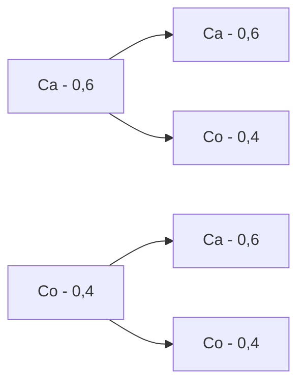

# Tabela de Frequências Discreta
### Frequência Absoluta
É o número de vezes que um determinado valor ou categoria aparece em um conjunto de dados.
- **Exemplo:** Se você tem uma lista de frutas: maçã, banana, maçã, laranja, maçã, a frequência absoluta da maçã é 3, porque ela aparece três vezes.
### Frequência Relativa
É a frequência absoluta de um valor dividida pelo total de valores, expressando a proporção ou a porcentagem do total.
- **Exemplo:** Continuando com o exemplo das frutas (total de 5 frutas), a frequência relativa da maçã seria 3 (frequência absoluta) dividido por 5 (total de frutas), que é 0,6 ou 60%.
### Frequência Acumulada
É a soma das frequências absolutas de todos os valores até um determinado ponto. Mostra o total acumulado conforme você avança nos dados.
- **Exemplo:** Se tivermos uma lista de números de 1 a 5 e queremos a frequência acumulada:
    - O número 1 aparece 1 vez (frequência acumulada = 1)
    - O número 2 aparece 1 vez (frequência acumulada = 1 + 1 = 2)
    - O número 3 aparece 1 vez (frequência acumulada = 2 + 1 = 3)
    - O número 4 aparece 1 vez (frequência acumulada = 3 + 1 = 4)
    - O número 5 aparece 1 vez (frequência acumulada = 4 + 1 = 5)

![[est-freq.png]]
# Tabelas
### Linhas
Mostrar a tendência de dados ao longo do tempo.
- **Exemplo:** Um gráfico de linha pode mostrar como a temperatura muda durante uma semana.
### Colunas
Comparar quantidades diferentes lado a lado.
- **Exemplo:** Um gráfico de colunas pode mostrar a quantidade de livros vendidos por mês.
### Setores (ou Gráfico de Pizza)
Mostrar partes de um todo.
- **Exemplo:** Um gráfico de setores pode mostrar a porcentagem de tipos de frutas vendidas em uma loja.
### Histogramas
Mostrar a distribuição de dados em intervalos, frequência dos dados.
- **Exemplo:** Um histograma pode mostrar quantas pessoas têm alturas em diferentes intervalos (como 150-160 cm, 160-170 cm, etc.).
# Probabilidade 
#### Teorema da Soma
Em um experimento aleatório de espaço amostral S, dados dois eventos A, B ⊂ S, temos que:
$$
P(A⋃B) = P(A) + P(B) - P(A⋂B)
$$
![[prob-teos.png]]
##### Exemplo
Se retirarmos uma carta aleatória de um baralho com 52 cartas, qual é a probabilidade de cair uma das cartas do naipe de copas (13) ou ser uma figura (12), sabendo que 3 cartas com figuram fazem interseção com as cartas do naipe de copas.
$$
 \frac{22}{52} = \frac{13}{52} + \frac{12}{52} - \frac{3}{52}
$$
#### Teoria do Evento Complementar
É um evento não (não A) em um experimento aleatório de espaço amostral S, dados evento A ⊂ S, temos que
$$
P(A^c) = 1-P(A)
$$
![[prob-tec.png]]
##### Exemplo
No lançamento de dois dados temos o espaço amostral de 36 elementos (6x6). Considerando os eventos em que a soma seja quatro, temos: {(1, 3), (3, 1), (2, 2)}. Sendo assim, a probabilidade de cair uma soma igual a quatro é 3/36, para determinar a probabilidade de não sair uma soma quatro é
$$
  P(A^c) = 1-\frac{3}{36} = \frac{11}{12}
$$
#### Exercícios
Qual é a probabilidade de sair duas caras no lançamento de duas moedas honestas? E a probabilidade de sair uma cara e uma coroa?
_Primeiro, é necessário montar o espaço amostral, ao jogar duas moedas as combinações possíveis são: **(CA CA, CO CO, CA CO, CO CA) (CA=cara, CO=coroa)**,  dessa forma, o espaço amostral é formado por 4 possibilidades, no qual a formação de duas caras representa apenas um elemento  do espaço  amostral. Assim a probabilidade cair duas coras seguidas é 1/4 . Do mesmo modo, a probabilidade de sair uma cara e uma cora é de 2/4_ 
 
 ## Calculando o espaço amostral
 Uma forma de calcular o elemento amostral é multiplicar todas as possibilidades de cada evento. Por exemplo, ao lançar quatro moedas, cada moeda tem duas possibilidade de cair um lado, ou seja o espaço amostral é de 2.2.2.2=16.
#### Análise Combinatória
Em uma sala com 15 alunos será formada uma comissão de formatura com 4 alunos. Qual é a probabilidade do Luciano participar desta comissão?
_Primeiro, é preciso saber que devemos utilizar a fórmula da combinação simples, visto que, a ordem dos elementos não é importante e não é possível repetir elementos nas combinações. Dessa forma, precisamos calcular primeiro todas as combinações possíveis com todos os alunos utilizando a fórmula._
$$
\frac{15!}{4!(15-4)!} = \frac{15*14*13*12}{4!} = 1365
$$
_Agora, é necessário ver as combinações com um aluno já definido (Luciano), dessa forma calculamos apenas para 14 alunos e 3 alunos na comissão._
$$
\frac{14!}{3!*14-3)!} = \frac{14*13*12}{3!} = 364
$$
_Depois, é só calcular a probabilidade utilizando a fórmula Casos Favoráveis/Espaço Amostral._
$$
\frac{364}{1365} = 0,2667
$$
#### Probabilidade Condicional
A probabilidade de um determinado evento ocorrer, sabendo que um evento condicionante já aconteceu.
$$
P(A|B) = \frac{P(A⋂B)}{P(B)}
$$
#### Eventos Independentes
Dado dois eventos, estes são independentes quando a probabilidade de ocorrer um deles não depende do fato de os outros terem ou não terem ocorrido. 
$$
P(A⋃B)=P(A).P(B)
$$
##### Exercício
No lançamento de dois dados honestos, qual é a probabilidade do primeiro dado ser par e do segundo dado ser maior que 4?
_Visto que, os dois eventos não tem relação, basta calcular a probabilidade do primeiro e do segundo evento e multiplica-las._
$$
\frac{3}{6}.\frac{2}{6} = \frac{1}{6}
$$
#### Probabilidade em Espaços não Equiprováveis
Calculada a partir de possibilidades que não tem o mesma probabilidade de ocorrer.
##### Exercício
Supomos que uma moeda foi viciada, de tal forma que a probabilidade de sair cara é de 0,6. Calcule a probabilidade de sair pelo menos uma coroa, lançando esta moeda duas vezes.
_Podemos resolver utilizando a árvore de probabilidades._


_Podemos calcular todas as probabilidades possível apenas multiplicando cada ramo da árvore de possibilidades. 
P(CA, CA) = 0,6.0,6=0,36
P(CO, CO)= 0,6.0,4=0,24
P(CO, CA)= 0,6.0,4=0,24
P(CO, CO)= 0,4.0,4=0,16
Somando as probabilidades de pelo menos uma cara, temos 0,24+0,24+0,16=0,64._
#### Teorema da Probabilidade Total
Lei que permite calcular a probabilidade de um evento que não faz parte de um espaço amostral a partir das probabilidades condicionais de todos os eventos nesse espaço amostral. Dado pela fórmula:
$$
P(B) = \sum_{i=1} ^{N} P(B|An).P(Ai)
$$
##### Exercício
Suponha que três fábricas forneçam lâmpadas para o mercado. As lâmpadas da fábrica X trabalham por mais de 5 000 horas em 99% dos casos, enquanto as lâmpadas de Y trabalham por mais de 5 000 horas em 95% e da fábrica Z em 90% dos casos. Sabe-se que a fábrica X fornece 60% e Y fornece 30% das lâmpadas. Qual é a chance de que a lâmpada comprada irá funcionar por mais de 5 000 horas?
_Primeiro, é importante anotar as probabilidades de se comprar uma lâmpada nas lojas. Assim, P(X) = 0,6, P(Y) = 0,3, P(Z) = 0,1. Agora, é necessário anotar quais são as probabilidades de comprar uma lâmpada e ela durar mais de 5000 horas. P(+5k|X) = 0,99, P(+5k|Y) = 0,95, P(+5k|Z) = 0,9. Dessa forma, basta aplicar os valores na fórmula, realizando o somatório obtendo um chance de 96,9%._
$$
P(+5k|X).P(X) + P(+5k|Y).P(Y) + P(+5k|Z).P(Z)=0,99.0,6+0,95*0,3+0,9.0,1=0,969
$$
#### Teorema de Bayes
O teorema de Bayes é uma **fórmula de probabilidade** que calcula a possibilidade de um evento acontecer, com base em um conhecimento que pode estar relacionado ao evento.
$$
P(A_k|B) =  \frac{P(B|A_k).P(A_k)}{\sum_{i=1} ^{N} P(B|A_i).P(A_i)}
$$
##### Exercício
Imaginemos que o teste de mamografia se comporte da seguinte forma:
• 1% das mulheres têm câncer de mama
• 80% das mamografias detectam o câncer quando ele existe
• 9% das mamografias detectam o câncer quando ele não existe
Qual é a probabilidade de uma mulher com resultado positivo tenha de fato câncer?
_Primeiro, organizamos as probabilidades. 
Ter câncer é P(C) = 0,01
Não tem câncer é P(SC) = 0,99
Ter câncer e ser positivo é P(Po|C) = 0,8
Ter câncer e ser falso positivo é P(N|C) = 0,2
Não ter câncer e ser positivo é P(Po|SC)= 0,09
Não ter câncer e ser um falso positivo é P(N|SC) = 0,91
Aplicaremos na fórmula a probabilidade do resultado positivo ser realmente câncer P(C|PO) é de 8,2%_
$$
P(C|Po)=\frac{P(Po|C).P(C)}{\sum_{i=1} ^{2} P(Po|Ai).P(Ai)}=\frac{0,8.0,01}{P(Po|C).P(C)+P(Po|SC).P(SC)} = \frac{0,8.0,01}{0,8.0,01+0,09.0,99} = 0,082
$$
```ad-tip
Esse somatório representa o evento complementar relacionado a condição, nesse caso P(Po), multiplicando todas as probabilidade condicionais com o evento da condicional de Po, nesse casso P(Po|C).P(C)+P(Po|SC).P(SC)
```
# Variáveis Aleatórias
Pode ser entendida como uma varável quantitativa, cuja o resultado (valor) depende de fatores aleatórios. Cada valor está associado a um elemento do espaço amostral. 

Por exemplo:
- _Número de coroas obtido no lançamento de 2 moedas;_
- _Número de itens defeituosos em uma amostra retirada;_
- _Intervalo de peso de uma amostra aleatória da população;_
#### Discretas
Quando o conjunto de resultados possíveis é finito ou enumerável. 

Por exemplo:
- _Número de filhos;_
- _Alunos em uma escola;_
##### Exercício
_No lançamento de duas moedas, a quantidade de caras é uma variável aleatória discreta. Pois:_
_X=0   CO, CO_
_X=1  CA, CO ou CO, CA_
_X=2  CA, CA_
#### Contínuas
Quando os valores são expressos como intervalo ou união de números reais. (limitados ou infinitos)

Por exemplo:
- _Peso, massa, altura;_
- _Nível de açúcar no sangue;_
##### Exercício
_Em relação à cidade de Bauru, a altura da população é uma Variável Aleatória Contínua.
Pois, existem vários valores em um intervalo com infinitos valores entre eles._
# Função de Probabilidade
A Função de Probabilidade é uma função que associa a cada valor da **V.A.** , a um número , que satisfaz as seguintes propriedades:
$$
0 \leq P(X = x_0) \leq 1
$$
$$
\sum_{{x_i \in X}} P(X = x_i) = 1
$$
##### Exercício
_Supomos que em um Call Center, a probabilidade de cada atendente estar disponível para fazer um atendimento é de 0,7. A empresa conta com 4 atendentes e quer que a probabilidade de uma ligação ser atendida seja superior a 99%. A empresa deve contratar mais atendentes?_
_Como precisa ter no mínimo 1 atendente, é possível calcular a probabilidade não ter nenhum atendente e usar o evento complementar:
0,3^4.1 = 0,0081
1 - 0,0081 = 99,19
Dessa forma, não é preciso contratar mais ninguém pois já passa 99% por cento._
# Medidas de Tendência Central
#### Média Geométrica
$$
\sqrt[n]{x_1 \cdot x_2 \cdot x_3 \cdot ... \cdot x_n}
$$
#### Quartis
Os **quartis** são valores que dividem um conjunto de dados em quatro partes iguais. Existem três quartis principais:

- **Primeiro quartil (Q1)**: Divide os 25% menores dados do restante.
- **Segundo quartil (Q2)** ou mediana: Divide os dados ao meio.
- **Terceiro quartil (Q3)**: Divide os 75% menores dados dos 25% maiores.
# Medidas de dispersão
#### Desvio Médio
Pega a média e calcula em cada valor a diferença da média e divide pelo total.
$$
 DM = \frac{\sum_{i=1}^{N} Fi|x_i - \bar{x}|}{n}
$$
#### Variância
A soma das diferenças das médias elevado ao quadrado. (Populacional, denominador = n; amostral = n - 1)
$$
V^2 = \frac{\sum_{i=1}^{N} Fi{|x_i - \bar{x}|}^2}{n}
$$
$$
DP = \sqrt{V}
$$
#### Coeficiente de Variação
$$
CV = \frac{V}{\bar{x}}
$$
# Análise Combinatória
#### Princípio Fundamental da Contagem
O princípio fundamental da contagem (ou princípio multiplicativo) é utilizado para encontrar o número de possibilidades para um evento constituído de **k** etapas. Para isso, as etapas devem ser sucessivas e independentes.
##### Exemplo
Carina quer escolher uma roupa para sair. Ela dispõe de 2 calças e 4 blusas, quantas possibilidades ela pode escolher?
_Como as escolhas não são restritivas e são independentes, é possível multiplicar as quantidades de opções para saber as combinações totais: 2.4=8_
#### Número Binomial
Eles representam o número de maneiras de escolher **p** elementos distintos em um conjunto com **n** elementos. Nesta escolha, a ordem dos elementos não é considerada.
$$
 C_{n, p} =  \frac{n!}{p!(n-p)!}
$$
#### Permutação Simples
É a ordenação dos elementos de um conjunto finito, quando seus **elementos não se repetem**. É utilizada para determinar a quantidade dessas ordenações. n=p
##### Exemplo
Temos 5 pessoas e 5 cadeiras, de quantas formas diferentes podemos acomodar estas pessoas nestas cadeiras?
_Da mesma forma utilizada no principio fundamental da contagem, é possível  multiplicar as possibilidades de cada posição, ou seja, na primeira cadeira é  possível sentar qualquer uma das 5 pessoas, na segunda é possível somente 4, pois já tem uma pessoa sentada na  primeira cadeira, e assim por diante até a última cadeira. O resultado seria: 5.4.3.2.1=120 possibilidades. A permutação simples também pode ser calculada utilizando o n!, no caso do exemplo 5!=120 possibilidades._ 
#### Permutação com Repetição
Supomos que queremos permutar **n** elementos. Temos que **k** se repetem, respectivamente n₁, n₂ ... nk, vezes. Então, a quantidade de permutações possíveis será:
$$
P(n₁,n₂... nk) = \frac{n!}{n₁!.n₂!...nk!}
$$
##### Exemplo
Quantos anagramas tem a palavra **MATEMATICA**?
_Primeiramente, é necessário separar as letras que se repetem, dessa forma M=2, A=3, T=2, assim, aplicando a fórmula da permutação colocamos o total de letras em cima como fatorial, e em baixo o fatorial da quantidade de repetição de cada letra._
$$
\frac{10!}{2!.3!.2!} = 151200
$$
#### Arranjo Simples
Agrupamentos formados com **n** elementos tomados de **p** em **p**, sabendo que o valor de **n** > **p**. No qual, a ordem da ordenação é importante.
$$
A_{n,p} = \frac{n!}{(n-p)!}
$$
##### Exemplo
Quantas possibilidades de senhas existem em um cofre, sabendo que nesse cofre as senhas tem 4 dígitos e que os dígitos de cada senha devem ser distintos?
_Aplicando na fórmula, número de elementos possíveis 10 (0 até 9), possibilidade 4 (dígitos no cofre)._
$$
\frac{10!}{(10-4)!} = \frac{10!}{6!} = 5040
$$
_Também é possível resolver utilizando o princípio fundamental da contagem. Como no primeiro dígito tem 10 opções, o segundo 9 e assim por diante, podemos fazer 10.9.8.7=5040_
#### Arranjo com Repetição
Reagrupamentos ordenados que podemos formar com **k** elementos de um conjunto com **n** elementos, sendo que um elemento de **n** pode aparecer mais de uma vez. No qual, a ordem da ordenação é importante. Sabendo que o valor de n > k ou k > n.

$$
A_{n,p} = n^p
$$
##### Exemplo
Quantas possibilidades de senhas existem em um cofre, sabendo que nesse cofre as senhas tem 4 dígitos?
_Basta entender que em cada espaço do dígito podem ir 10 possibilidades (0 até 9), dessa forma é só multiplicar 10.10.10.10 que chegará ao resultado 10^4 ou seguindo a fórmula: n=10, p=4: 10^4._ 
#### Combinação Simples
Combinação a contagem de todos os subconjuntos de **k** elementos que podemos formar de um conjunto de **n** elementos. No qual, a ordem dos elementos não é importante, não existindo repetições entre os elementos. Sabendo que **n** > **k**.
$$
 C_{n,p} =  \frac{n!}{p!(n-p)!}
$$
##### Exemplo
Em uma sala com 7 alunos, o professor Douglas vai escolher 3 alunos para formar uma comissão para a formatura da turma. Quantas comissões distintas é possível formar?
_Visto que, a ordem da comissão selecionada não importa e não pode repetir elementos, é possível  saber o resultado utilizando a fórmula da  combinação simples na qual o n=7 (alunos), p=3 (alunos da comissão)_
$$
\frac{7!}{3!(7-3)!} = \frac{7!}{3!.4!} = 35
$$
#### Combinação com Repetição
Um conjunto **C** com **n** elementos, admitindo repetições com **k** elementos, todos pertencentes ao conjunto **C**.
$$
C_{n, p} = \frac{(n + p - 1)!}{p!(n-1)!}
$$
##### Exemplo
Shirley faz três tipos de doces (brigadeiro, beijinho e cajuzinho) e vende uma caixa com 8 doces dentre estes 3 tipos. Quantas combinações distintas é possível fazer, em relação a esta caixa de doces?
_Visto que, a ordem dos elementos não importam e é possível repetir elementos basta utilizar a fórmula da combinação com repetição._
$$
\frac{(3 + 8 - 1)!}{8!{(3-1)}!}= \frac{10!}{8!.2!} = \frac{90}{2} = 45
$$